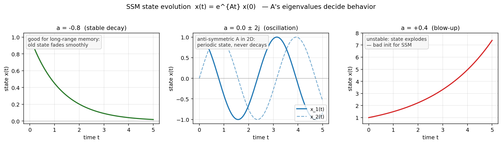

# 第 1 节:状态空间模型(SSM)基础

> 本节目标:从连续时间线性系统出发,理解 SSM 的三个核心矩阵 $A,B,C$,以及为什么它可以看作一种"可学习的动态记忆"。

---

## 1.1 从一个水箱开始

想象一个水箱:

- $u(t)$:这一刻流入的水量
- $x(t)$:水箱里当前的水位
- $y(t)$:我们读出的水位信号

水位的变化由两件事决定:

1. 原来的水会慢慢流失
2. 新流入的水会增加水位

最简单的微分方程:

$$
\frac{dx(t)}{dt} = ax(t) + bu(t)
$$

输出:

$$
y(t) = cx(t)
$$

这就是最小版本的状态空间模型。

---

## 1.2 向量形式

真实模型不会只用一个水箱,而是用 $N$ 维状态向量:

$$
x(t) \in \mathbb{R}^{N}
$$

输入和输出先看成标量:

$$
u(t) \in \mathbb{R},\quad y(t) \in \mathbb{R}
$$

连续时间 SSM 写成:

$$
\frac{dx(t)}{dt} = Ax(t) + Bu(t)
$$

$$
y(t) = Cx(t)
$$

其中:

$$
A \in \mathbb{R}^{N \times N}
$$

$$
B \in \mathbb{R}^{N \times 1}
$$

$$
C \in \mathbb{R}^{1 \times N}
$$

> 💡 **关于标量输入的简化**
>
> 这里我们把输入 $u(t)$ 写成标量,主要是为了让数学清爽。**真实 Mamba 处理 $D$ 维 embedding 序列**:
>
> $$u \in \mathbb{R}^{B \times L \times D}$$
>
> 实现上是**每个 channel $d$ 独立跑一个 $N$ 维 SSM**,通道间不混合(通道混合留给 block 外的 Linear 完成)。所以单层内部状态张量的真实形状是 $(B, L, D, N)$。
>
> 本节后续的所有公式都可以看作"某个 channel 内部的子系统"。我们会在第 4 节再展开多通道的细节。

---

## 1.3 三个矩阵分别干什么?

### $A$:状态如何自己演化

如果没有新输入:

$$
u(t)=0
$$

那么:

$$
\frac{dx(t)}{dt}=Ax(t)
$$

$A$ 决定旧记忆如何衰减、振荡、混合。

### $B$:输入如何写入状态

$$
Bu(t)
$$

决定当前输入进入状态空间的方向。

### $C$:如何从状态读出输出

$$
y(t)=Cx(t)
$$

决定从内部记忆中读出哪些成分。

---

## 1.4 SSM 为什么像记忆?

展开直觉:

```
新输入 u(t) 通过 B 写入状态 x(t)
状态 x(t) 通过 A 持续演化
输出 y(t) 通过 C 从状态中读取
```

所以 $x(t)$ 就是一种压缩历史:

$$
x(t) = \text{summary}(u(\tau), \tau \leq t)
$$

它不像 Attention 那样保存所有 token 的 Key/Value,而是把过去压进固定大小的状态向量。

---

## 1.5 线性 ODE 的解

先看没有输入的情况:

$$
\frac{dx(t)}{dt}=Ax(t)
$$

解是:

$$
x(t)=e^{At}x(0)
$$

含义:**当前状态 = 矩阵指数 $e^{At}$ 作用在初始状态 $x(0)$ 上**。也就是说,矩阵指数 $e^{At}$ 就是从 $0$ 时刻到 $t$ 时刻的"状态传播算子"。

### 严格推导:一阶线性齐次 ODE 的解

> **假设**:$A \in \mathbb{R}^{N \times N}$ 是常矩阵(不随 $t$ 变化),$x(t) \in \mathbb{R}^N$,初值 $x(0)$ 已知。
>
> **推导**:把 $e^{At}$ 按定义展开:
> $$e^{At} = \sum_{k=0}^{\infty} \frac{(At)^k}{k!} = I + At + \frac{(At)^2}{2!} + \cdots$$
> 逐项求导(级数一致收敛):
> $$\frac{d}{dt}e^{At} = A + A^2 t + \frac{A^3 t^2}{2!} + \cdots = A \cdot e^{At}$$
> 所以 $x(t) = e^{At} x(0)$ 满足:
> $$\frac{dx}{dt} = A e^{At} x(0) = A x(t) \;\checkmark$$
> 且初值正确:$x(0) = e^{0} x(0) = I \cdot x(0) = x(0)$。
>
> **结论**:$x(t) = e^{At} x(0)$ 就是这个 ODE 的唯一解。

这里的矩阵指数定义为:

$$
e^{At}=I+At+\frac{(At)^2}{2!}+\frac{(At)^3}{3!}+\cdots
$$

它是标量指数函数 $e^{at}$ 的矩阵版本。

📌 **直观**:如果把 $A$ 做特征分解 $A = V \Lambda V^{-1}$,则 $e^{At} = V e^{\Lambda t} V^{-1}$——也就是**沿 $A$ 的每个特征方向各自做标量指数衰减/增长**。所以 $A$ 的特征值控制了状态各个模式的演化时间常数,这是后面 HiPPO/S4 选择 $A$ 时的核心考虑。

<div align="center"></div>

图:三种典型特征值下 $x(t)=e^{At}x(0)$ 的演化——左:实部为负 → 稳定衰减(SSM 想要的);中:纯虚数 → 周期振荡;右:实部为正 → 指数爆炸(坏初始化)。脚本见 [scripts/generate_figures.py](scripts/generate_figures.py)。

---

## 1.6 带输入的解

完整方程:

$$
\frac{dx(t)}{dt}=Ax(t)+Bu(t)
$$

从 $0$ 到 $t$ 的解:

$$
x(t)=e^{At}x(0)+\int_0^t e^{A(t-\tau)}Bu(\tau)d\tau
$$

这个公式很重要:

- 第一项:初始状态随时间演化
- 第二项:历史输入不断写入状态,再被 $A$ 演化到当前时刻

这说明 SSM 本质上在对历史输入做一种带记忆核的加权积分。

---

## 1.7 卷积视角

如果初始状态为 0:

$$
x(0)=0
$$

则:

$$
y(t)=C\int_0^t e^{A(t-\tau)}Bu(\tau)d\tau
$$

可以写成卷积:

$$
y(t)=\int_0^t K(t-\tau)u(\tau)d\tau
$$

其中:

$$
K(s)=Ce^{As}B
$$

也就是说,SSM 既可以递推地看:

```
状态一步步更新
```

也可以卷积地看:

```
用一个长卷积核扫过序列
```

S4 这类模型正是利用了这个卷积视角来并行训练。

---

## 1.8 离散序列还差一步

文本是离散 token:

```
u_1, u_2, ..., u_L
```

但我们现在写的是连续时间:

$$
u(t), x(t)
$$

所以还需要把连续系统离散化,得到:

$$
x_t = \bar{A}x_{t-1} + \bar{B}u_t
$$

$$
y_t = Cx_t
$$

这里的 $\bar{A},\bar{B}$ 就是离散化后的参数。

---

## 1.9 本节核心要点

1. SSM 用状态 $x(t)$ 压缩历史输入
2. $A$ 控制状态自身演化,$B$ 控制输入写入,$C$ 控制状态读出
3. 连续时间 SSM 是线性 ODE
4. 矩阵指数 $e^{At}$ 描述状态随时间传播
5. SSM 既可以看作递推,也可以看作卷积

---

## 1.10 下一节预告

下一节解决离散化:

- 如何从连续 ODE 得到离散递推?
- $\bar{A}$ 和 $\bar{B}$ 怎么计算?
- ZOH 和双线性变换有什么区别?
- 为什么步长 $\Delta$ 很关键?

→ [第 2 节:SSM 离散化](02-ssm-discretization.md)

---

## 1.11 思考题(可选)

1. 如果 $A$ 是**反对称矩阵**($A^T = -A$),状态 $x(t)$ 会有什么行为?和稳定衰减(对角负实部)有什么本质区别?
2. SSM 的"卷积视角"和 CNN 的卷积有什么相同和不同?它能写成 PyTorch 里的 `nn.Conv1d` 吗?
3. 如果训练时把 $A$ 当作可学习参数,梯度反向传播会遇到什么困难?(提示:矩阵指数的导数)

<details>
<summary><b>参考思路</b>(先自己想 3-5 分钟再展开)</summary>

**1.** 反对称矩阵的特征值是**纯虚数**,所以 $e^{At}$ 不衰减也不放大,而是**振荡**(类比简谐运动 $\frac{d^2 x}{dt^2} = -\omega^2 x$)。这种 SSM 适合周期性信号,但对单调衰减的"遗忘"行为不友好。S4D 系列通常把 $A$ 限制成**对角且实部为负**,既稳定又便于 $e^{A\Delta}$ 计算。

**2.** SSM 的卷积核 $K_k = C\bar{A}^k\bar{B}$ 是一个**长度为 $L$、单通道、因果**的卷积核——参数不是直接学的,而是从 $(A, B, C)$ 推出来。CNN 的卷积核是直接参数化的、长度固定、跨通道的。SSM 等价于一个"参数化生成无限长卷积核"的方案。可以写成 Conv1d 但要 $L$ 长度的 kernel,显存大,所以 S4 用 FFT 加速。

**3.** $\bar{A} = e^{A\Delta}$ 对 $A$ 的导数涉及 **矩阵指数的 Fréchet 导数**,一般形式很复杂。S4 和 Mamba 都把 $A$ 限制成**对角**(或 diagonal-plus-low-rank, DPLR),让 $e^{A\Delta}$ 变成逐元素 $\exp$,导数就回到简单标量,可以直接 backprop。这是工程上的关键妥协。

</details>

---

## 1.12 论文/源码对照

| 概念 | 论文符号 / 章节 | 源码位置 |
|---|---|---|
| 连续 SSM $A, B, C$ | S4 paper §2, Eq.(1) | `mamba_ssm/modules/mamba_simple.py` 中 `A_log, D` |
| 矩阵指数解 $x(t)=e^{At}x(0)$ | 控制论标准结论 | (通过 ZOH 离散化间接出现) |
| 卷积核 $K(s)=Ce^{As}B$ | S4 paper §3.1 | `mamba_ssm/ops/triton/selective_state_update.py` |
| 输入/状态/输出 ($u, x, y$) | Mamba paper §2.1 | 输入张量名通常是 `u`,状态名通常是 `ssm_state` |
