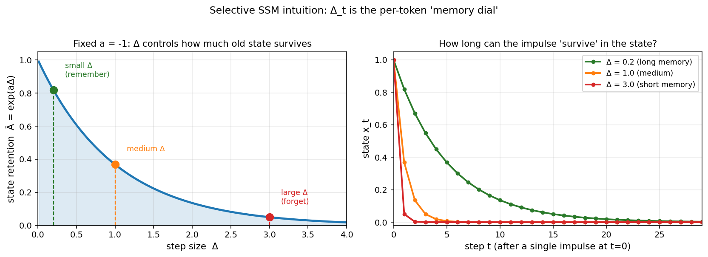

# 第 2 节:SSM 离散化

> 本节目标:把连续时间 SSM 变成可以处理 token 序列的离散递推,理解 $\Delta$、$\bar{A}$、$\bar{B}$ 的来源。

---

## 2.1 为什么需要离散化?

上一节的连续系统是:

$$
\frac{dx(t)}{dt}=Ax(t)+Bu(t)
$$

$$
y(t)=Cx(t)
$$

但语言模型看到的是 token 序列:

$$
u_1,u_2,\dots,u_L
$$

所以我们需要一个离散版本:

$$
x_t=\bar{A}x_{t-1}+\bar{B}u_t
$$

$$
y_t=Cx_t
$$

问题是:

> $\bar{A},\bar{B}$ 和连续参数 $A,B$ 到底是什么关系?

---

## 2.2 时间步长 $\Delta$

离散化需要指定每个 token 之间相隔多长时间:

$$
t_0, t_1, t_2, \dots
$$

如果步长固定:

$$
t_i - t_{i-1} = \Delta
$$

那么从 $t-\Delta$ 到 $t$ 的状态更新由连续解给出:

$$
x(t)=e^{A\Delta}x(t-\Delta)+\int_{0}^{\Delta}e^{A(\Delta-\tau)}Bu(t-\Delta+\tau)d\tau
$$

只要处理积分项,就能得到离散递推。

---

## 2.3 零阶保持(ZOH)

ZOH 的假设是:

> 在一个离散时间间隔内,输入保持常数。

也就是:

$$
u(t-\Delta+\tau)=u_t,\quad 0\leq \tau \leq \Delta
$$

代入 2.2 节积分:

$$
x_t=e^{A\Delta}x_{t-1}+\left(\int_0^\Delta e^{A(\Delta-\tau)}d\tau\right)Bu_t
$$

做变量代换 $s=\Delta-\tau$(对 $A$ 可逆时把积分换成更标准形式):

$$
\int_0^\Delta e^{A(\Delta-\tau)}d\tau \;=\; \int_0^\Delta e^{As}\,ds
$$

于是:

$$
\bar{A}=e^{A\Delta}
$$

$$
\bar{B}=\left(\int_0^\Delta e^{As}\,ds\right)B
$$

如果 $A$ 可逆,积分有闭式:

$$
\bar{B}=A^{-1}(e^{A\Delta}-I)B
$$

这就是常见的 ZOH 离散化公式。

> 🔧 **Mamba 源码里的一阶近似**
>
> Mamba 实现中 $A$ 是 diagonal、$\Delta$ 通常很小,所以源码常用一阶 Taylor 展开把 $\bar{B}$ 近似为:
>
> $$\bar{B}_t \approx \Delta_t \cdot B_t$$
>
> 推导:把 $e^{A\Delta} \approx I + A\Delta$ 代入 $\bar{B}=A^{-1}(e^{A\Delta}-I)B$,得到 $\bar{B} \approx A^{-1}\cdot A\Delta\cdot B = \Delta B$。这避免了 $A^{-1}$ 的数值问题,代价是 $A$ 不再精确"出现在" $\bar{B}$ 里。原论文公式叫 *"simplified discretization"*,在 `mamba-ssm/ops/selective_scan_interface.py` 里就能看到。

---

## 2.4 直觉: $\Delta$ 控制记忆速度

看一维情况:

$$
\frac{dx}{dt}=ax+bu
$$

则:

$$
\bar{A}=e^{a\Delta}
$$

如果 $a<0$,状态会衰减。

- $\Delta$ 小:$e^{a\Delta}$ 接近 1,旧状态保留更多
- $\Delta$ 大:$e^{a\Delta}$ 更小,旧状态衰减更快

所以 $\Delta$ 可以理解成当前 token 的"时间跨度"。

<div align="center"></div>

图:固定连续衰减率 $a=-1$,左:状态保留率 $\bar{A}=e^{a\Delta}$ 随 $\Delta$ 单调下降;右:单脉冲注入后,小 $\Delta$ 让记忆持续 20+ 步,大 $\Delta$ 几步就消失。**Mamba 让 $\Delta_t$ 依赖输入,等于给模型一个"per-token 记忆旋钮"**。脚本见 [scripts/generate_figures.py](scripts/generate_figures.py)。

Mamba 让 $\Delta$ 依赖输入,这会非常关键。

---

## 2.5 双线性变换(Bilinear / Tustin)

另一种常见离散化是双线性变换:

$$
\bar{A}=(I-\frac{\Delta}{2}A)^{-1}(I+\frac{\Delta}{2}A)
$$

$$
\bar{B}=(I-\frac{\Delta}{2}A)^{-1}\Delta B
$$

它可以看作一种梯形积分近似,数值稳定性较好。

S4 系列常讨论 bilinear transform；Mamba 实现中常见的是类似 ZOH 的 selective scan 离散化形式。

---

## 2.6 离散递推展开

离散 SSM:

$$
x_t=\bar{A}x_{t-1}+\bar{B}u_t
$$

展开几步:

$$
x_1=\bar{A}x_0+\bar{B}u_1
$$

$$
x_2=\bar{A}^2x_0+\bar{A}\bar{B}u_1+\bar{B}u_2
$$

$$
x_3=\bar{A}^3x_0+\bar{A}^2\bar{B}u_1+\bar{A}\bar{B}u_2+\bar{B}u_3
$$

如果 $x_0=0$,输出:

$$
y_t=Cx_t=\sum_{j=1}^{t} C\bar{A}^{t-j}\bar{B}u_j
$$

这就是离散卷积形式。

---

## 2.7 卷积核

定义:

$$
K_k=C\bar{A}^k\bar{B}
$$

那么:

$$
y_t=\sum_{j=1}^{t}K_{t-j}u_j
$$

这说明离散 SSM 等价于一个长卷积:

```
输入序列 u
↓
卷积核 K
↓
输出序列 y
```

如果 $\bar{A},\bar{B},C$ 固定,这个卷积核可以预先算出来,训练时可以并行。

---

## 2.8 Mamba 为什么不能只靠卷积?

Mamba 的选择性参数依赖输入:

$$
\bar{B}_t,\ C_t,\ \Delta_t
$$

这意味着每个位置的系统参数都不同。

于是卷积核不再是固定的:

$$
K_{t-j} \neq C\bar{A}^{t-j}\bar{B}
$$

不能简单预计算一个固定卷积核扫完整段序列。

这就是 Mamba 需要 **selective scan** 的原因:既保留输入依赖的灵活性,又尽量并行化递推。

---

## 2.9 代码骨架:一维离散 SSM

```python
import torch

def run_ssm(u, A_bar, B_bar, C):
    """
    朴素的离散 SSM 串行递推 (用于理解,不用于训练)。

    Args:
        u:     (L,)      标量输入序列
        A_bar: (N, N)    离散化后的状态转移矩阵
        B_bar: (N,)      离散化后的输入投影
        C:     (N,)      状态读出向量

    Returns:
        ys:    (L,)      输出序列
    """
    N = A_bar.size(0)
    x = torch.zeros(N, device=u.device)   # 初始状态 x_0 = 0
    ys = []

    for t in range(u.size(0)):
        # 一步递推:x_t = A_bar @ x_{t-1} + B_bar * u_t
        x = A_bar @ x + B_bar * u[t]
        # 读出:y_t = C^T x_t
        y = C @ x
        ys.append(y)

    return torch.stack(ys)
```

这个循环就是 SSM 最朴素的推理形式。

⚠️ **训练时不要这样写**:这段代码在序列维上是 `for` 循环,无法并行,训练 4K 长度都很慢。真实训练用的是:
- **固定参数 SSM**(S4): 把 SSM 等价转换为卷积,用 FFT 在 $O(L \log L)$ 时间并行
- **选择性 SSM**(Mamba): 用 parallel prefix scan 在 $O(L \log L)$ 时间并行(见第 5 节)

---

## 2.10 本节核心要点

1. 离散化把连续 ODE 变成 token 序列上的递推
2. ZOH 得到 $\bar{A}=e^{A\Delta}$
3. $\Delta$ 控制状态更新的时间尺度
4. 固定参数 SSM 可以写成卷积形式
5. Mamba 的输入依赖参数打破固定卷积核,需要 selective scan

---

## 2.11 下一节预告

下一节看 S4 和 HiPPO:

- 为什么普通 SSM 难以长程记忆?
- HiPPO 想解决什么问题?
- S4 如何把 SSM 变成长序列模型?
- Mamba 和 S4 的关系是什么?

→ [第 3 节:S4 与 HiPPO](03-s4-hippo.md)

---

## 2.12 思考题(可选)

1. ZOH 假设"间隔内输入保持常数",这显然在采样真实信号时不严格成立。它带来什么近似误差?和"线性插值"假设(双线性变换)相比哪个更准?
2. Mamba 让 $\Delta_t$ 依赖输入。如果某 token 给出特别大的 $\Delta_t$,会发生什么?特别小呢?
3. 如果两个相邻 token 的 $\Delta, B, C$ 完全相同,Mamba 在这两步上的行为和固定 SSM 有区别吗?为什么?

<details>
<summary><b>参考思路</b>(先自己想 3-5 分钟再展开)</summary>

**1.** ZOH 默认 $u(\tau) \equiv u_t$ 整个区间,所以系统对 $[t-\Delta, t]$ 内的输入变化"看不见",误差是 $O(\Delta)$。双线性变换隐含线性插值,误差是 $O(\Delta^2)$,理论上更准。但在深度学习里,$\Delta$ 是可学习的、$B, C$ 是可学习的,模型可以"自适应"补偿离散化误差——所以 Mamba 选 ZOH 配上一阶近似 $\bar{B} \approx \Delta B$,实现简单数值稳定,精度不是瓶颈。

**2.** 看 $\bar{A}_t = e^{\Delta_t A}$:
- $\Delta_t$ 很大 → $e^{\Delta_t A}$ 接近 0(假设 $A$ 实部为负)→ 几乎完全丢弃旧状态、把新输入写进去 → "重置 + 写入"
- $\Delta_t$ 很小 → $e^{\Delta_t A}$ 接近 $I$ → 状态几乎不动 → "跳过这个 token"

所以 $\Delta_t$ 起到了一个非常类似 LSTM 遗忘门的角色,只是用连续时间步长的形式表达。

**3.** **没有区别**。Mamba 的"选择性"只来自参数随输入变化,如果两步的参数恰好相同,这两步就退化成普通 SSM 的两次相同操作。换句话说,Mamba 在 $\Delta, B, C$ 不变的区段上**就是固定 SSM**,优势完全来自"哪些 token 的参数会变化"——这是它和 S4 在数学上的精确区别。

</details>

---

## 2.13 论文/源码对照

| 概念 | 论文符号 / 章节 | 源码位置 |
|---|---|---|
| ZOH 离散化 $\bar{A}, \bar{B}$ | Mamba paper §2.1 Eq.(4); S4 paper §2.2 | `mamba_ssm/ops/triton/selective_state_update.py` 中 `dt`、`A_log` |
| 一阶近似 $\bar{B}_t \approx \Delta_t B_t$ | Mamba paper "simplified discretization" | `selective_scan_interface.py` 中 `is_simplified=True` |
| 双线性 / Tustin 变换 | S4 paper Appendix; 经典控制论 | (Mamba 未使用) |
| 离散卷积视角 $K_k = C\bar{A}^k\bar{B}$ | S4 paper §3.2 | S4 官方实现 `s4d.py` (FFT 卷积) |
| Selective scan 不能用固定卷积 | Mamba paper §3.2 | `selective_scan_fn` 替代 FFT |
