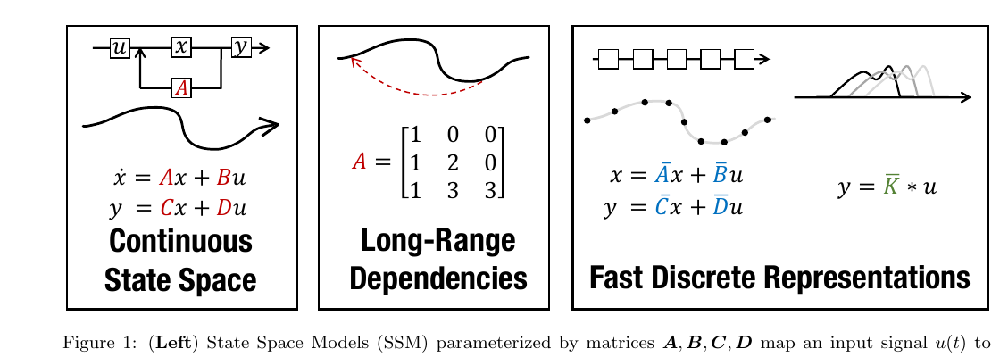

# 第 3 节:S4 与 HiPPO

> 本节目标:理解 S4 为什么能把 SSM 用到长序列建模,以及 HiPPO 想解决的"如何把历史压进有限状态"问题。

---

## 3.1 普通状态压缩的难题

SSM 的状态:

$$
x_t \in \mathbb{R}^{N}
$$

要压缩整个历史:

$$
u_1,u_2,\dots,u_t
$$

但状态维度 $N$ 是固定的。

这就像只有一页笔记,却要持续读一本越来越长的书。关键问题是:

> 这页笔记应该以什么方式保存过去,才能尽量少丢信息?

普通 RNN 往往让模型自己学这个压缩方式,但长序列上很难稳定。

HiPPO 的目标就是给"在线压缩历史"一个更有数学结构的答案。

---

## 3.2 HiPPO 的核心问题

HiPPO 全称是:

> High-order Polynomial Projection Operators

它研究的问题可以粗略说成:

> 给定到目前为止的连续输入函数 $u(\tau)$,如何用一个有限维向量 $x(t)$ 表示它的历史?

一种自然想法是:用一组基函数近似历史函数。

比如:

$$
u(\tau) \approx \sum_{n=0}^{N-1} x_n(t) p_n(\tau)
$$

其中 $p_n$ 是某种正交多项式基,$x_n(t)$ 是投影系数。

状态 $x(t)$ 存的就是这些系数。

---

## 3.3 为什么用正交多项式?

正交基的好处类似傅里叶级数:

- 每个基函数负责不同模式
- 系数之间尽量不冗余
- 低阶项捕捉粗略趋势
- 高阶项捕捉细节变化

如果把历史信号投影到 Legendre 多项式这类正交基上,状态向量就不再是随便学出来的黑盒,而有了明确含义:

$$
x(t)=\text{历史函数在一组基上的投影系数}
$$

---

## 3.4 HiPPO 如何变成 SSM?

HiPPO 推导出一组特殊的连续时间矩阵 $A,B$,使得状态 $x(t)$ 在线更新时,始终近似保存历史函数的投影系数:

$$
\frac{dx(t)}{dt}=Ax(t)+Bu(t)
$$

这正好是 SSM 形式。

所以 HiPPO 给 SSM 提供的是一种**初始化和结构设计原则**:

> 选择合适的 $A,B$,让状态天然适合长程记忆。

---

## 3.5 S4 的位置

S4 可以理解为:

> 把 HiPPO 风格的结构化 SSM 做成可训练、可并行、适合深度学习的序列层。



图:S4 论文对 State Space Model 的直观概览:连续状态空间、长程依赖结构、离散/卷积表示。来源:Gu et al., 2021, *Efficiently Modeling Long Sequences with Structured State Spaces*, Figure 1。

S4 使用一个连续时间 SSM:

$$
x'(t)=Ax(t)+Bu(t)
$$

$$
y(t)=Cx(t)+Du(t)
$$

离散化后得到:

$$
x_t=\bar{A}x_{t-1}+\bar{B}u_t
$$

$$
y_t=Cx_t+Du_t
$$

其中 $D$ 是 skip connection,让当前输入可以直接影响输出。

---

## 3.6 S4 的关键:结构化 $A$

如果 $A$ 是完整的 $N \times N$ 矩阵,计算会很贵。

S4 使用结构化参数化,让 $A$ 可以高效计算长卷积核:

$$
K_k=C\bar{A}^k\bar{B}
$$

然后训练时把 SSM 当作卷积:

$$
y = K * u
$$

这样可以用 FFT 等方法并行处理整段序列。

---

## 3.7 递推视角 vs 卷积视角

同一个 SSM 有两种运行方式:

### 推理时:递推

```text
x_t = A_bar x_{t-1} + B_bar u_t
y_t = C x_t
```

逐 token 更新,适合流式生成。

### 训练时:卷积

```text
y = K * u
```

整段序列并行,适合 GPU。

这是 S4 很重要的优势:它不像传统 RNN 那样训练时完全串行。

---

## 3.8 S4 到 Mamba:固定到选择性

S4 的 $A,B,C$ 基本是对所有时间步共享的。

这带来一个限制:

> 同一个卷积核处理所有输入,不能根据当前 token 动态改变记忆策略。

Mamba 的关键改动是:

$$
B_t = B(x_t),\quad C_t = C(x_t),\quad \Delta_t = \Delta(x_t)
$$

也就是让写入、读出和步长都依赖输入。

代价是:不能再用固定卷积核直接 FFT。

收益是:模型有了类似 Attention 的"内容选择性"。

---

## 3.9 为什么选择性很重要?

语言序列里不是每个 token 都同等重要。

例如:

```
The password is 7391. ... many tokens ... What is the password?
```

模型应该在看到 "7391" 时把它写入状态,并在看到问题时从状态中读出来。

固定 SSM 很难对不同 token 采取完全不同的写入策略。

Mamba 让 $B_t,C_t,\Delta_t$ 依赖输入,本质上就是给状态模型加了门控:

- 重要 token:强写入、慢遗忘
- 普通 token:弱写入、快跳过

---

## 3.10 本节核心要点

1. HiPPO 研究如何把历史函数在线压缩成有限维状态
2. HiPPO 可以导出适合长程记忆的 SSM 矩阵结构
3. S4 把结构化 SSM 做成可训练的序列层
4. 固定 SSM 可以用卷积视角并行训练
5. Mamba 在 S4 基础上引入输入依赖的选择性参数

---

## 3.11 下一节预告

下一节正式进入 Mamba:

- Selective SSM 的公式是什么?
- $\Delta,B,C$ 为什么要依赖输入?
- Mamba block 里卷积、门控、SSM 分别做什么?
- 它和 Transformer block 的分工有什么相似之处?

→ [第 4 节:Mamba Selective SSM](04-mamba-selective.md)
