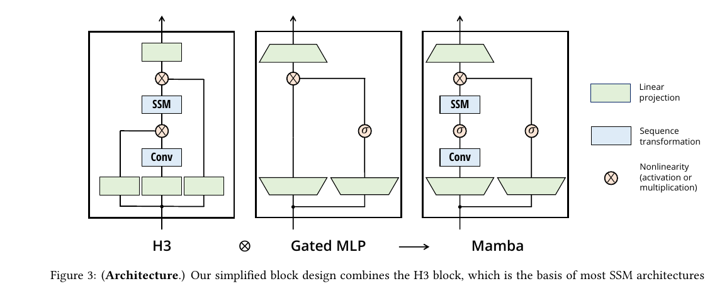

# 第 4 节:Mamba:Selective SSM

> 本节目标:理解 Mamba 的选择性状态空间模型,看懂 $\Delta_t,B_t,C_t$ 随输入变化的意义,以及 Mamba block 的基本结构。

---

## 4.1 固定 SSM 的限制

普通离散 SSM:

$$
x_t=\bar{A}x_{t-1}+\bar{B}u_t
$$

$$
y_t=Cx_t
$$

这里 $\bar{A},\bar{B},C$ 对所有位置都一样。

这意味着模型对每个 token 使用同一种更新规则。

但语言中 token 的重要性不同:

```
姓名、数字、代码变量、否定词
```

这些信息可能要长期保留。

而普通停用词、标点、重复片段可能只需要快速扫过。

---

## 4.2 Mamba 的选择性

Mamba 的核心是让部分 SSM 参数依赖输入:

$$
\Delta_t = \Delta(u_t)
$$

$$
B_t = B(u_t)
$$

$$
C_t = C(u_t)
$$

然后每个位置使用自己的离散化参数:

$$
\bar{A}_t = \exp(\Delta_t A)
$$

$$
\bar{B}_t = \text{discretize}(A,B_t,\Delta_t)
$$

递推:

$$
x_t=\bar{A}_t x_{t-1}+\bar{B}_t u_t
$$

$$
y_t=C_t x_t
$$

<div align="center"></div>

图:Mamba block 把 H3 风格的 SSM 分支和 gated MLP 思路合到一个重复堆叠的模块里。来源:Gu & Dao, 2023, *Mamba: Linear-Time Sequence Modeling with Selective State Spaces*, Figure 3。

---

## 4.3 三个选择性参数的直觉

### $\Delta_t$:时间步长

$\Delta_t$ 控制状态更新速度。

- 大 $\Delta_t$:状态快速变化,更容易遗忘旧信息
- 小 $\Delta_t$:状态慢慢变化,保留更多历史

### $B_t$:写入方向

$B_t$ 决定当前输入如何写入状态。

重要 token 可以写入更多维度,普通 token 可以少写。

### $C_t$:读出方式

$C_t$ 决定当前 token 从状态里读什么。

问题 token 可能需要读出很久以前保存的信息。

---

## 4.4 选择性像门控记忆

可以把 Mamba 想象成一个动态笔记本:

```
读到重要信息 → 用 B_t 写进笔记
读到普通信息 → 少写或快速覆盖
遇到问题 → 用 C_t 从笔记里读相关内容
```

Attention 是显式翻原文:

```
我现在要找谁?直接对所有 token 算相似度
```

Mamba 是流式维护笔记:

```
每一步决定写什么、忘什么、读什么
```

---

## 4.5 Mamba Block 的高层结构

一个简化的 Mamba block:

```
输入 x
│
├── Linear expand
│
├── depthwise conv  ← 提供局部上下文
│
├── 生成 Δ, B, C
│
├── selective scan  ← 长程序列混合
│
├── gate 分支
│
└── Linear project
```

它不像 Transformer 那样用 attention 矩阵混合 token,而是通过 selective scan 沿序列更新状态。

---

## 4.6 为什么还有卷积?

Mamba block 中有一个短卷积(depthwise convolution)。

作用:

> 在进入 SSM 前,先让每个位置看到附近几个 token。

SSM 擅长长程递推,但局部模式(比如短语、字符组合、局部语法)用小卷积很便宜也很有效。

Depthwise conv 表示每个通道单独卷积,参数和计算都比较少。

---

## 4.7 门控分支

Mamba 还有一条 gate 分支,常见形式类似:

$$
\text{out} = \text{SSM}(x) \odot \text{SiLU}(z)
$$

这和 SwiGLU 的思想相似:

> 一条分支产生内容,另一条分支决定哪些内容通过。

门控能提高表达能力,也让模型更容易控制状态输出。

---

## 4.8 伪代码

```python
class MambaBlock(nn.Module):
    def __init__(self, d_model, d_inner, d_state):
        super().__init__()
        self.in_proj = nn.Linear(d_model, 2 * d_inner)
        self.conv = nn.Conv1d(
            d_inner, d_inner,
            kernel_size=4,
            groups=d_inner,
            padding=3,
        )
        self.x_proj = nn.Linear(d_inner, dt_rank + 2 * d_state)
        self.out_proj = nn.Linear(d_inner, d_model)

    def forward(self, x):
        # x: (batch, L, d_model)
        x, gate = self.in_proj(x).chunk(2, dim=-1)

        # depthwise conv expects (batch, channels, L)
        x = self.conv(x.transpose(1, 2))[:, :, :x.size(1)].transpose(1, 2)
        x = torch.nn.functional.silu(x)

        # 生成输入依赖的 Δ, B, C
        params = self.x_proj(x)
        dt, B, C = split_params(params)

        y = selective_scan(x, dt, B, C)
        y = y * torch.nn.functional.silu(gate)
        return self.out_proj(y)
```

这不是完整源码,但抓住了结构。

---

## 4.9 和 Transformer Block 对比

| Transformer | Mamba |
|-------------|-------|
| Attention 混合全局信息 | Selective scan 混合历史信息 |
| FFN 做通道变换 | Linear + gate 做通道变换 |
| KV Cache 保存历史 token 表示 | SSM state 保存压缩历史 |
| $O(L^2)$ attention | $O(L)$ scan |

关键区别:

> Transformer 保存可检索的历史表示;Mamba 保存递推压缩后的状态。

---

## 4.10 本节核心要点

1. Mamba 让 $\Delta_t,B_t,C_t$ 依赖输入,形成 Selective SSM
2. $\Delta_t$ 控制时间尺度,$B_t$ 控制写入,$C_t$ 控制读出
3. Mamba block 结合了线性投影、局部卷积、selective scan 和门控
4. Mamba 用固定大小状态替代 KV Cache,长序列更省内存
5. 它不是 Attention 的简单替代,而是一种不同的序列混合机制

---

## 4.11 下一节预告

Mamba 公式看起来是递推的,似乎训练时必须串行。但 Mamba 的重要贡献之一就是硬件感知的并行扫描:

- scan 为什么能并行?
- associative operator 是什么?
- 为什么不能把所有中间状态都写到 HBM?
- selective scan 如何贴合 GPU?

→ [第 5 节:硬件感知并行扫描](05-mamba-parallel-scan.md)
