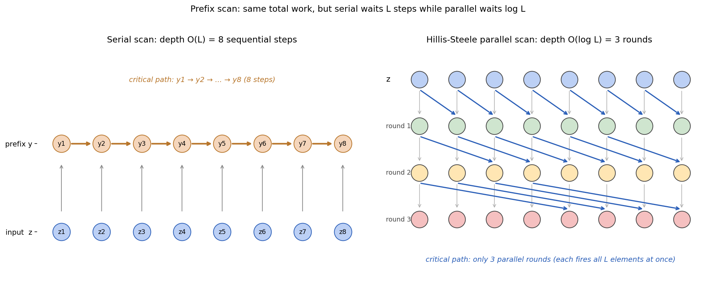

# 第 5 节:硬件感知并行扫描

> 本节目标:理解 Mamba 为什么既是递推模型,又能高效训练;看懂 parallel scan 和硬件感知实现背后的直觉。

---

## 5.1 递推看起来不能并行

Mamba 的状态更新类似:

$$
x_t=\bar{A}_t x_{t-1}+\bar{B}_t u_t
$$

第 $t$ 步依赖第 $t-1$ 步,看起来必须:

```
x1 → x2 → x3 → ... → xL
```

这像 RNN,训练时很难充分利用 GPU。

但 Mamba 的一个关键点是:这个递推有特殊结构,可以用 scan 并行化。

---

## 5.2 把一步更新看成仿射变换

> 🔑 **前提:Mamba 用 diagonal $A$**
>
> Mamba 的一个关键工程选择是把 $A \in \mathbb{R}^{N \times N}$ 取为 **diagonal**(对角)。这样每个状态分量 $x_t^{(i)}$ 完全独立:
>
> $$x_t^{(i)} = \bar{A}_t^{(i)} \, x_{t-1}^{(i)} + \bar{B}_t^{(i)} u_t,\quad i = 1,\dots,N$$
>
> 这意味着我们**可以把矩阵递推拆成 $N$ 个独立的标量递推**,下面的标量 prefix scan 分析对每个分量分别成立。一般稠密矩阵 $A$ 也能做 scan(仿射变换的结合律对矩阵也成立),但合并代价是 $O(N^3)$ 矩阵乘,远比标量贵。

每一步更新(对某一个状态分量,下面省略上标 $(i)$):

$$
x_t=a_t x_{t-1}+b_t
$$

其中:

$$
a_t=\bar{A}_t,\quad b_t=\bar{B}_t u_t
$$

这一步可以看成一个函数:

$$
f_t(x)=a_t x+b_t
$$

连续两步:

$$
x_2=f_2(f_1(x_0))
$$

展开:

$$
x_2=a_2(a_1x_0+b_1)+b_2=(a_2a_1)x_0+(a_2b_1+b_2)
$$

也就是说,两个仿射变换可以合并成一个新的仿射变换。

---

## 5.3 可结合运算

定义一个二元运算:

$$
(a_2,b_2)\circ(a_1,b_1)=(a_2a_1,\ a_2b_1+b_2)
$$

它表示先做 $(a_1,b_1)$,再做 $(a_2,b_2)$。

### 严格推导:$\circ$ 满足结合律

> **要证**:$(c) \circ ((b) \circ (a)) = ((c) \circ (b)) \circ (a)$,其中 $a=(a_1,b_1), b=(a_2,b_2), c=(a_3,b_3)$。
>
> **左边**:先合 $(b)\circ(a) = (a_2 a_1,\, a_2 b_1 + b_2)$,再合 $c$:
> $$(c)\circ(b\circ a) = (a_3 \cdot a_2 a_1,\, a_3(a_2 b_1 + b_2) + b_3) = (a_3 a_2 a_1,\, a_3 a_2 b_1 + a_3 b_2 + b_3)$$
>
> **右边**:先合 $c \circ b = (a_3 a_2,\, a_3 b_2 + b_3)$,再合 $a$:
> $$(c\circ b)\circ(a) = (a_3 a_2 \cdot a_1,\, a_3 a_2 b_1 + (a_3 b_2 + b_3)) = (a_3 a_2 a_1,\, a_3 a_2 b_1 + a_3 b_2 + b_3)$$
>
> 两边相等 ✓
>
> **结论**:$\circ$ 是**结合律满足**的二元运算,所以 $f_L \circ f_{L-1} \circ \cdots \circ f_1$ 可以任意打括号——这正是并行 scan 的数学前提。

⚠️ **不需要交换律**。注意 $a \circ b \neq b \circ a$:先衰减后加偏置,和先加偏置后衰减,结果不同。Prefix scan 只要求**结合律**,顺序仍然要按从左到右——并行的是"合并的方式",不是"序列的顺序"。

有结合律,就可以做 parallel prefix scan。

---

## 5.4 Prefix Scan 是什么?

给一串元素:

$$
z_1,z_2,\dots,z_L
$$

prefix scan 要计算每个**前缀的累积合并**:

$$
z_1,\quad z_2 \circ z_1,\quad z_3 \circ z_2 \circ z_1,\quad \dots,\quad z_L \circ \cdots \circ z_1
$$

如果 $\circ$ 有结合律,就可以像树一样并行合并,而不是从左到右串行扫。

这就是 Mamba 能训练并行化的数学基础。

### 工作量对比

| 方法 | 总工作量 | 关键路径 (深度) |
|---|---|---|
| **串行扫描** (RNN 风格) | $O(L)$ | $O(L)$ — 必须等前一步 |
| **Hillis-Steele scan** (并行) | $O(L \log L)$ | $O(\log L)$ — 树状合并 |
| **Blelloch scan** (并行,work-efficient) | $O(L)$ | $O(\log L)$ |

📌 **关键洞察**:并行 scan 的总工作量(FLOPs)可能比串行多一个 $\log L$ 因子,但**关键路径深度从 $L$ 降到 $\log L$**——GPU 上后者是几个数量级的差距。$L=8192$ 时,串行 8192 步 vs 并行 13 步。这就是为什么 Mamba 可以训练 $L=64K$ 而 RNN 训练 $L=1K$ 都很痛苦。

<div align="center"></div>

图:左:串行 scan 必须依次计算 $y_1 \to y_2 \to \cdots$,关键路径 $O(L)$;右:Hillis-Steele 并行 scan 把 $L$ 个元素分 $\log_2 L$ 轮合并,每轮**所有位置同时**做一次 $\circ$ 操作,关键路径 $O(\log L)$。$L=8$ 时:8 步 vs 3 轮。脚本见 [scripts/generate_figures.py](scripts/generate_figures.py)。

---

## 5.5 为什么说硬件感知?

GPU 的内存层级大致是:

| 位置 | 特点 |
|------|------|
| HBM 显存 | 容量大,但访问相对慢 |
| SRAM / shared memory | 容量小,但非常快 |
| registers | 更小,更快 |

如果 selective scan 每一步都把中间状态写回 HBM,再读出来,带宽会成为瓶颈。

Mamba 的实现思路是:

> 把中间状态尽量留在片上 SRAM/registers,只把必要结果写回显存。

<div align="center"></div>

图:Mamba 的 Selective SSM 概览:$B_t,C_t,\Delta_t$ 由输入生成,并通过硬件感知 scan 避免把大状态完整写回 HBM。来源:Gu & Dao, 2023, *Mamba: Linear-Time Sequence Modeling with Selective State Spaces*, Figure 1。

这和 FlashAttention 的精神很像:不是只改数学公式,还要按 GPU 的内存层级重新组织计算。

---

## 5.6 Selective Scan 的挑战

固定 SSM 可以预计算卷积核:

$$
K_k=C\bar{A}^k\bar{B}
$$

Mamba 不行,因为:

$$
\bar{A}_t,\bar{B}_t,C_t
$$

每个位置都不同。

所以它不能退回简单 FFT 卷积,必须真的处理输入依赖的递推。

Selective scan 的目标:

1. 保留输入依赖的选择性
2. 避免串行 RNN 式训练
3. 减少 HBM 读写

---

## 5.7 推理时仍然是递推

训练时可以对整段序列做并行 scan。

推理生成时,每次只来一个新 token:

$$
x_t=\bar{A}_t x_{t-1}+\bar{B}_t u_t
$$

这时直接维护最新状态即可。

和 Transformer 的 KV Cache 对比:

| 模型 | 推理缓存 |
|------|----------|
| Transformer | 每层所有历史 K/V,随 $L$ 增长 |
| Mamba | 每层固定大小 SSM state,基本不随 $L$ 增长 |

这就是 Mamba 长上下文推理的巨大优势。

---

## 5.8 直觉总结

Mamba 的训练效率来自三个层次:

1. 数学上:状态更新可以表示成可结合的仿射变换
2. 算法上:用 parallel prefix scan 并行计算前缀状态
3. 硬件上:尽量减少 HBM 中间状态读写

少任何一层,都很难成为真正好用的长序列模型。

---

## 5.9 本节核心要点

1. Mamba 的递推可以写成仿射变换组合
2. 仿射变换组合满足结合律,因此可以做 parallel scan
3. Selective scan 解决输入依赖 SSM 不能用固定卷积的问题
4. 硬件感知实现重点是减少 HBM 往返,把中间状态留在片上
5. 推理时 Mamba 只需维护固定大小状态,不像 Transformer KV Cache 随序列增长

---

## 5.10 下一节预告

Jamba 还用了 MoE 来扩大参数容量。下一节看:

- 为什么 dense FFN 成本高?
- Top-K gating 如何选择专家?
- load balance loss 为什么必要?
- MoE 的总参数和激活参数为什么不同?

→ [第 6 节:Mixture of Experts](06-moe.md)

---

## 5.11 思考题(可选)

1. Prefix scan 工作量比串行多 $\log L$ 倍,为什么 GPU 上反而更快?和"并行不一定省功"的常识冲突吗?
2. 如果 Mamba 不用 selective scan,而是把"输入依赖参数"先算好,再展开成一个 $L \times L$ 的下三角矩阵直接做 matmul,可不可以?为什么实际不这么做?
3. 推理 decode 时一次只来一个 token,scan 完全用不上——这时 Mamba 相比 Attention 还有性能优势吗?为什么?

<details>
<summary><b>参考思路</b>(先自己想 3-5 分钟再展开)</summary>

**1.** **不冲突**。"省功"指的是 FLOPs 总量,但 GPU 性能瓶颈通常不是 FLOPs 而是**等待**——串行 RNN 在序列维上每一步必须等上一步,GPU 上几千个 SM 大部分都闲着。Prefix scan 多花 FLOPs 但**让所有 SM 同时干活**,墙钟时间从 $O(L)$ 降到 $O(\log L)$。所以"并行"的真正收益是**时延**(latency),不是吞吐量(throughput)——这点和 FlashAttention 共享同一思路:多算几次,但避免等待和 HBM 往返。

**2.** **数学上可以,工程上不行**。展开成 $L \times L$ 矩阵的存储是 $O(L^2)$,对长序列(Jamba 训练用 $L = 4K\sim 256K$)直接爆显存。这其实就是 Mamba-2 走的方向——SSD 把 selective SSM 重写成 **block-decomposed matmul**:不存完整 $L \times L$ 矩阵,但按 $L/B$ 块依次 matmul。Mamba-1 的 scan 方案存的是 $O(L \cdot N)$ 中间状态,SRAM 友好。两者各有取舍。

**3.** **优势更大**。Decode 时:
- Attention 每步要从 HBM 读完整 KV Cache(大小 $\sim L \cdot D$ per layer),memory-bound
- Mamba 每步只更新一个固定大小的 SSM state(大小 $\sim D \cdot N$ per layer,**不随 $L$ 增长**)

所以 $L$ 越大,Mamba 的 decode 优势越大。在 256K 上下文 decode 时,Attention 每生成一个 token 要扫描 GB 级 KV,Mamba 只读 KB 级状态——这是 Jamba 选 Mamba 主导架构的**最关键工程动机**。

</details>

---

## 5.12 论文/源码对照

| 概念 | 论文符号 / 章节 | 源码位置 |
|---|---|---|
| Selective scan 算法 | Mamba paper Algorithm 1 | `mamba_ssm/ops/selective_scan_interface.py::selective_scan_fn` |
| 并行 prefix scan kernel | Mamba paper §3.3 | `mamba_ssm/ops/triton/selective_state_update.py` (Triton 版) |
| SRAM-aware 实现 | Mamba paper §3.3.2 | CUDA 版 `csrc/selective_scan/selective_scan_fwd_kernel.cuh` |
| Recurrent inference | Mamba paper §3.3 | `mamba_simple.py::step` |
| FlashAttention 类比 | Dao 2022 (arxiv 2205.14135) | `flash-attn` 仓库 |
| Hillis-Steele / Blelloch scan | Blelloch 1990 (CMU TR) | NVIDIA `thrust::inclusive_scan` |
