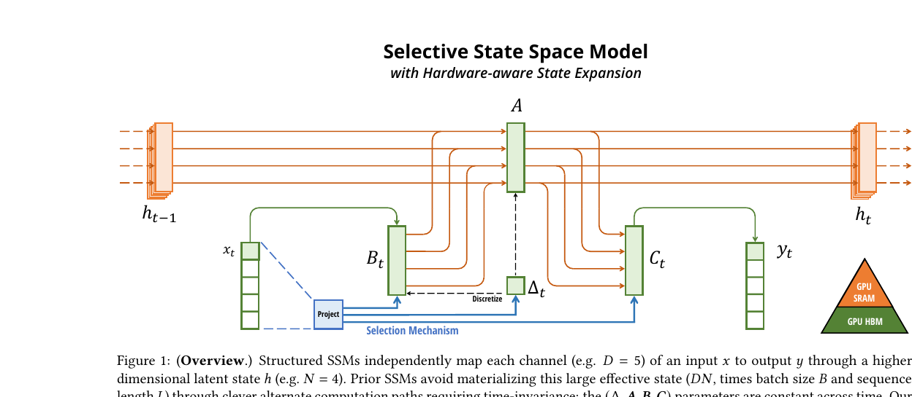

# 第 5 节:硬件感知并行扫描

> 本节目标:理解 Mamba 为什么既是递推模型,又能高效训练;看懂 parallel scan 和硬件感知实现背后的直觉。

---

## 5.1 递推看起来不能并行

Mamba 的状态更新类似:

$$
x_t=\bar{A}_t x_{t-1}+\bar{B}_t u_t
$$

第 $t$ 步依赖第 $t-1$ 步,看起来必须:

```
x1 → x2 → x3 → ... → xL
```

这像 RNN,训练时很难充分利用 GPU。

但 Mamba 的一个关键点是:这个递推有特殊结构,可以用 scan 并行化。

---

## 5.2 把一步更新看成仿射变换

每一步更新:

$$
x_t=a_t x_{t-1}+b_t
$$

其中:

$$
a_t=\bar{A}_t,\quad b_t=\bar{B}_t u_t
$$

这一步可以看成一个函数:

$$
f_t(x)=a_t x+b_t
$$

连续两步:

$$
x_2=f_2(f_1(x_0))
$$

展开:

$$
x_2=a_2(a_1x_0+b_1)+b_2=(a_2a_1)x_0+(a_2b_1+b_2)
$$

也就是说,两个仿射变换可以合并成一个新的仿射变换。

---

## 5.3 可结合运算

定义一个二元运算:

$$
(a_2,b_2)\circ(a_1,b_1)=(a_2a_1,\ a_2b_1+b_2)
$$

它表示先做 $(a_1,b_1)$,再做 $(a_2,b_2)$。

这个运算满足结合律:

$$
f_3\circ(f_2\circ f_1)=(f_3\circ f_2)\circ f_1
$$

有结合律,就可以做 parallel prefix scan。

---

## 5.4 Prefix Scan 是什么?

给一串元素:

$$
z_1,z_2,\dots,z_L
$$

prefix scan 要计算:

$$
z_1
$$

$$
z_2 \circ z_1
$$

$$
z_3 \circ z_2 \circ z_1
$$

$$
\dots
$$

如果 $\circ$ 有结合律,就可以像树一样并行合并,而不是从左到右串行扫。

这就是 Mamba 能训练并行化的数学基础。

---

## 5.5 为什么说硬件感知?

GPU 的内存层级大致是:

| 位置 | 特点 |
|------|------|
| HBM 显存 | 容量大,但访问相对慢 |
| SRAM / shared memory | 容量小,但非常快 |
| registers | 更小,更快 |

如果 selective scan 每一步都把中间状态写回 HBM,再读出来,带宽会成为瓶颈。

Mamba 的实现思路是:

> 把中间状态尽量留在片上 SRAM/registers,只把必要结果写回显存。



图:Mamba 的 Selective SSM 概览:$B_t,C_t,\Delta_t$ 由输入生成,并通过硬件感知 scan 避免把大状态完整写回 HBM。来源:Gu & Dao, 2023, *Mamba: Linear-Time Sequence Modeling with Selective State Spaces*, Figure 1。

这和 FlashAttention 的精神很像:不是只改数学公式,还要按 GPU 的内存层级重新组织计算。

---

## 5.6 Selective Scan 的挑战

固定 SSM 可以预计算卷积核:

$$
K_k=C\bar{A}^k\bar{B}
$$

Mamba 不行,因为:

$$
\bar{A}_t,\bar{B}_t,C_t
$$

每个位置都不同。

所以它不能退回简单 FFT 卷积,必须真的处理输入依赖的递推。

Selective scan 的目标:

1. 保留输入依赖的选择性
2. 避免串行 RNN 式训练
3. 减少 HBM 读写

---

## 5.7 推理时仍然是递推

训练时可以对整段序列做并行 scan。

推理生成时,每次只来一个新 token:

$$
x_t=\bar{A}_t x_{t-1}+\bar{B}_t u_t
$$

这时直接维护最新状态即可。

和 Transformer 的 KV Cache 对比:

| 模型 | 推理缓存 |
|------|----------|
| Transformer | 每层所有历史 K/V,随 $L$ 增长 |
| Mamba | 每层固定大小 SSM state,基本不随 $L$ 增长 |

这就是 Mamba 长上下文推理的巨大优势。

---

## 5.8 直觉总结

Mamba 的训练效率来自三个层次:

1. 数学上:状态更新可以表示成可结合的仿射变换
2. 算法上:用 parallel prefix scan 并行计算前缀状态
3. 硬件上:尽量减少 HBM 中间状态读写

少任何一层,都很难成为真正好用的长序列模型。

---

## 5.9 本节核心要点

1. Mamba 的递推可以写成仿射变换组合
2. 仿射变换组合满足结合律,因此可以做 parallel scan
3. Selective scan 解决输入依赖 SSM 不能用固定卷积的问题
4. 硬件感知实现重点是减少 HBM 往返,把中间状态留在片上
5. 推理时 Mamba 只需维护固定大小状态,不像 Transformer KV Cache 随序列增长

---

## 5.10 下一节预告

Jamba 还用了 MoE 来扩大参数容量。下一节看:

- 为什么 dense FFN 成本高?
- Top-K gating 如何选择专家?
- load balance loss 为什么必要?
- MoE 的总参数和激活参数为什么不同?

→ [第 6 节:Mixture of Experts](06-moe.md)
