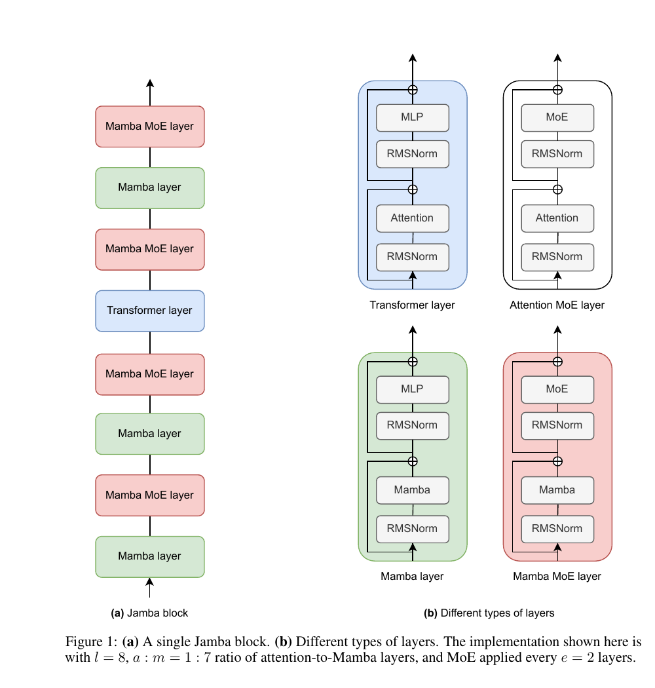

# 第 7 节:Jamba 整体架构

> 本节目标:把 Transformer Attention、Mamba 和 MoE 组合起来,理解 Jamba 的混合架构设计和参数预算直觉。

---

## 7.1 Jamba 的一句话概括

Jamba 是一个混合语言模型:

> 用 Mamba 层承担大部分长序列建模,用少量 Attention 层保留精确全局检索,用 MoE 扩大容量。

也就是:

```
Mamba + Attention + MoE
```

这不是简单拼贴,而是在三个目标之间折中:

1. 长上下文效率
2. 语言模型质量
3. 推理时激活参数可控

---

## 7.2 为什么不是纯 Mamba?

纯 Mamba 的优势是线性复杂度和固定状态缓存。

但 Attention 有一个 Mamba 很难完全替代的能力:

> 对任意历史 token 做显式内容寻址。

例如:

- 长文档里找一个具体数字
- 代码里匹配变量定义
- 多段证据之间做精确对齐

这些任务中,少量 Attention 层可以像"全局检索层"一样补足能力。

---

## 7.3 为什么不是纯 Transformer?

纯 Transformer 在长上下文下的代价太高:

$$
O(L^2)
$$

并且 KV Cache 随长度线性增长,层数越多越贵。

如果所有层都是 Attention,256K 上下文会非常吃显存和带宽。

Jamba 用 Mamba 层替代大部分 Attention 层,让大部分序列混合成本接近线性。

---

## 7.4 1:7 比例的直觉

Jamba 论文中的一个关键设计是 Attention 层和 Mamba 层按稀疏比例混合。

直觉上可以理解为:

```
少量 Attention 层:负责精确查找和全局对齐
大量 Mamba 层:负责高效传播和压缩长程上下文
```

如果用 1:7 来记:

```
每 8 个序列混合层里,大约 1 个 Attention,7 个 Mamba
```

> ⚠️ **关于 1:7 这个数字**
>
> "1:7 attention:mamba" 来自 **Jamba 1.0/1.5 论文**(arxiv 2403.19887, Figure 1)。本节后面"52B total / 12B active"也是 **Jamba 1.5 Mini** 的公开数字。
>
> **Jamba 2.0 Mini**(`jamba-mini-2-2026-01`)同样是 52B/12B/256K,但 AI21 没有公开它的具体层数、a:m 比例和 MoE 配置——可能延用 1.5 的结构,也可能调整过。需要确切数字时,以 AI21 模型卡或新论文为准,不要把这里的 1:7 当作 Jamba 2.0 的官方配置。
>
> 本节用 1:7 作为"代表性配置"来讲设计原理,这些原理(混合比例、MoE 稀疏激活)在 2.0 中应该仍然成立。

<div align="center"></div>

图:Jamba block 示例:以 $a:m=1:7$ 混合 Attention 和 Mamba,并每隔 $e=2$ 层使用 MoE。来源:Lieber et al., 2024, *Jamba: A Hybrid Transformer-Mamba Language Model*, Figure 1。

这让模型保留 Attention 的关键能力,同时大幅减少全 attention 架构的成本。

---

## 7.5 一个概念化 Block

可以把 Jamba 的层想象成两类:

### Attention Layer

```
Norm
↓
Attention
↓
Residual
↓
MoE / FFN
↓
Residual
```

### Mamba Layer

```
Norm
↓
Mamba selective scan
↓
Residual
↓
MoE / FFN
↓
Residual
```

二者的主要区别在序列混合模块:

| 层类型 | 序列混合 |
|--------|----------|
| Attention layer | Multi-Head / GQA Attention |
| Mamba layer | Selective SSM scan |

---

## 7.6 MoE 如何进入 Jamba?

Jamba 使用 MoE 来增加模型容量。

关键点:

> 总参数可以很大,但每个 token 只走少数专家。

例如 README 中写的 Jamba 2.0 mini 规格:

```
52B total parameters
12B active parameters
```

含义:

- 总共有 52B 参数可用
- 对每个 token 的一次前向,实际激活约 12B 参数

这就是 MoE 的稀疏激活优势。

---

## 7.7 参数预算的直觉

Dense 模型:

```
模型有 12B 参数
每个 token 大约激活 12B
```

MoE 模型:

```
模型总共有 52B 参数
每个 token 只激活 12B
```

所以 MoE 让模型拥有更大的"知识容量",但推理计算不按总参数线性增长。

当然,这不是免费午餐:MoE 会带来路由、通信、专家负载均衡等工程成本。

---

## 7.8 Jamba 的缓存结构

因为 Jamba 同时有 Attention 层和 Mamba 层,推理缓存也有两类:

| 层类型 | 缓存 |
|--------|------|
| Attention | KV Cache,随上下文长度增长 |
| Mamba | SSM state,大小基本固定 |

由于 Attention 层只占一部分,Jamba 的 KV Cache 压力比同规模全 Attention 模型低。

这对 256K 这类长上下文非常关键。

---

## 7.9 和 Transformer 的关系

Jamba 不是抛弃 Transformer。

更准确地说:

> Jamba 把 Transformer 中最贵的全局 attention 层减少到少量关键位置,其余位置用 Mamba 的线性状态更新承担序列建模。

它保留了现代 LLM 的很多基础组件:

- token embedding
- residual connection
- normalization
- FFN/MoE
- causal language modeling

变化主要在序列混合层。

---

## 7.10 本节核心要点

1. Jamba 混合 Mamba、Attention 和 MoE
2. Mamba 层提供长序列线性效率
3. Attention 层保留精确检索和全局对齐能力
4. MoE 增大总参数,但每个 token 只激活部分专家
5. Jamba 的缓存由少量 KV Cache 和大量固定 SSM state 组成

---

## 7.11 下一节预告

最后一节看训练和推理:

- Jamba 的 prefill 和 decode 分别发生什么?
- Attention KV Cache 与 Mamba state 如何共存?
- recurrent inference 为什么适合长上下文?
- 混合架构的工程取舍是什么?

→ [第 8 节:Jamba 训练与推理](08-jamba-training-inference.md)

---

## 7.12 思考题(可选)

1. Jamba 论文的消融实验显示:即使把 Attention 层的比例降到 1/8,长上下文召回质量仍然接近全 Attention。直觉上这是为什么?少量 Attention 层在做什么"独特"的工作?
2. MoE 放在 Mamba 层之后还是 Attention 层之后?Jamba 怎么决定的?如果只在某一类层后加 MoE,会有什么效果?
3. 如果让你自己设计一个"长上下文 + 高质量"的混合模型,你会怎么选 a:m 比例和 MoE 频率?有哪些自变量需要权衡?

<details>
<summary><b>参考思路</b>(先自己想 3-5 分钟再展开)</summary>

**1.** 关键直觉:**Mamba 层是高带宽传输介质,Attention 层是稀缺的精确寻址点**。Mamba 把任意位置的信息"摘要"传递到任何后续位置,Attention 层负责在某些关键位置做"内容寻址"——只要这种"精确寻址点"在整个深度里出现几次,模型就能完成 Needle-in-a-Haystack 类任务。类比:Mamba 是邮政系统(总能把信送到附近),Attention 是 GPS 定位(偶尔需要精确坐标)。只要 GPS 还能用,不需要每个路口都装。

**2.** Jamba 论文里 MoE 是**每 2 个 block 加一次**,不区分这个 block 是 Mamba 还是 Attention。直觉上,FFN/MoE 是**通道混合**,跟前面的"序列混合方式"无关——所以放在哪类层后都可以。但工程上,MoE 后接 Attention 层时,KV Cache 的内存压力和 MoE 路由的 all-to-all 通信可能在同一阶段争抢带宽,有可能要错开。

**3.** 自变量:(a) 目标上下文长度 → 长上下文偏向更高 m:a 比例;(b) 目标任务类型 → 召回密集型(代码、检索)需要更多 Attention,生成密集型可以少;(c) 推理硬件 → 显存大可以全 KV,显存小用 Mamba 多;(d) 训练算力预算 → MoE 总参数大但激活少,适合算力受限场景;(e) 模型规模 → 小模型可能 MoE 不划算,通信成本压倒激活节约。Jamba 的 1:7 + 每 2 层 MoE 是大模型场景下的一个工程平衡点,不是普适最优。

</details>

---

## 7.13 论文/源码对照

| 概念 | 论文符号 / 章节 | 源码位置 |
|---|---|---|
| Jamba block 结构 | Jamba paper §3 Figure 1, Algorithm 1 | HuggingFace `transformers.models.jamba.modeling_jamba.JambaModel` |
| Attention layer 配比 ($a:m=1:7$) | Jamba paper §3.1 | `JambaConfig.attn_layer_offset` / `attn_layer_period` |
| MoE 频率 ($e=2$) | Jamba paper §3.1 | `JambaConfig.expert_layer_offset` / `expert_layer_period` |
| Total / Active 参数划分 | Jamba paper Table 1 (1.5B/12B) | 模型卡参数表 |
| 256K 上下文 | Jamba 1.5 / 2.0 模型卡 | 推理时 `max_position_embeddings` 配置 |
