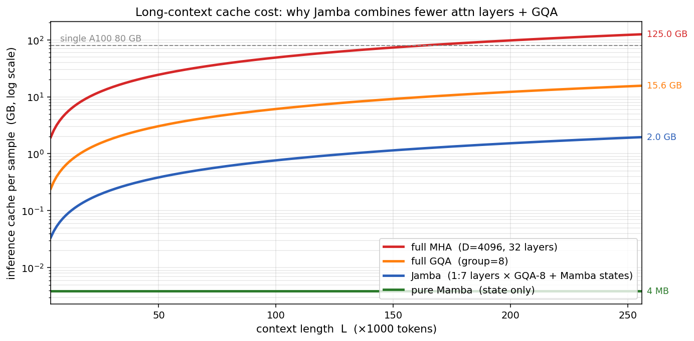

# 第 8 节:Jamba 训练与推理

> 本节目标:理解 Jamba 训练和推理时的执行方式,尤其是 Attention KV Cache 与 Mamba 隐状态如何共存。

---

## 8.1 训练目标仍然是语言模型

Jamba 虽然架构混合,但训练目标仍然是 causal language modeling:

$$
P(x_1,\dots,x_L)=\prod_{t=1}^{L}P(x_t\mid x_{<t})
$$

损失:

$$
\mathcal{L}=-\sum_{t=1}^{L}\log P(x_t\mid x_{<t})
$$

也就是说,它仍然是 next-token prediction。

架构变了,目标没变。

---

## 8.2 训练时的并行

训练时输入完整序列:

```
x_1, x_2, ..., x_L
```

Attention 层用 causal mask 并行计算。

Mamba 层用 selective scan 处理整段序列,也尽量并行化。

MoE 层对 token 做路由,把不同 token 分发给不同专家。

所以训练路径大致是:

```
Embedding
↓
[Mamba/Attention + MoE] × N
↓
LM Head
↓
Cross Entropy
```

---

## 8.3 Prefill 阶段

推理开始时,用户给出 prompt:

```
prompt length = L
```

模型要先把 prompt 全部读一遍,这叫 prefill。

在 Jamba 中:

- Attention 层计算 prompt 的 K/V,写入 KV Cache
- Mamba 层扫描 prompt,得到最后的 SSM state
- MoE 层正常按 token 路由

Prefill 之后,模型得到:

1. 少量 Attention 层的 KV Cache
2. 多个 Mamba 层的最终隐状态
3. 最后一个位置的 logits

---

## 8.4 Decode 阶段

之后每次生成一个新 token。

### Attention 层

新 token 产生:

$$
q_t,k_t,v_t
$$

把 $k_t,v_t$ 追加到 KV Cache:

$$
K_{\text{cache}}\leftarrow[K_{\text{cache}};k_t]
$$

$$
V_{\text{cache}}\leftarrow[V_{\text{cache}};v_t]
$$

然后 $q_t$ attend 历史所有 K/V。

### Mamba 层

新 token 更新固定状态:

$$
x_t=\bar{A}_t x_{t-1}+\bar{B}_t u_t
$$

只需要保存新的 $x_t$。

---

## 8.5 缓存增长对比

全 Transformer:

$$
\text{cache} \propto L \times \text{num\_layers}
$$

含义:**每生成一个新 token,Attention 都要从 HBM 读完整 KV Cache,所以解码延迟也线性增长**。

Jamba:

$$
\text{cache} \approx L \times \text{attention\_layers} + \text{constant} \times \text{mamba\_layers}
$$

因为 Attention 层只占一部分,Jamba 的长上下文缓存压力更小。

### 具体数字感受一下

假设 32 层 Transformer 模型,$D=4096$, FP16,256K 上下文:

| 架构 | 计算 | 缓存大小(每条样本) |
|---|---|---|
| 全 MHA | $2 \times 256K \times 4096 \times 32 \times 2B$ | **134 GB** ❌ 单卡放不下 |
| 全 GQA (8x) | 134 GB / 8 | **17 GB** ⚠️ A100 80G 也只能放几条 |
| Jamba 1:7 MHA | $134\text{GB} \times \tfrac{1}{8} + \text{SSM\_const}$ | **~17 GB** ✅ 但是用 MHA 不用 GQA |
| Jamba 1:7 + Mamba state | 上面 + 28 mamba layers × $D \times N$ | **17 GB + 几 MB** ✅ |

📌 **结论**:Mamba state 在 256K 长度下的内存压力**完全可以忽略**(几 MB),所以混合架构对长上下文的工程价值主要来自"减少 Attention 层数",而不是"Mamba state 本身有多省"。

<div align="center"></div>

图:同一规模(D=4096, 32 层, FP16)模型在 $L \in [4K, 256K]$ 时每条样本的推理缓存大小(对数轴)。256K 处:全 MHA = 125 GB(单卡 A100 装不下);全 GQA-8 = 15.6 GB;Jamba(1:7 + GQA-8)= 2 GB;纯 Mamba 状态 = 4 MB(几乎不增长)。脚本见 [scripts/generate_figures.py](scripts/generate_figures.py)。

这就是它适合长上下文的核心原因之一。

---

## 8.6 Recurrent Inference

Mamba 层天然支持 recurrent inference:

```
拿到一个新 token
↓
更新每层 SSM state
↓
输出当前 token 表示
```

状态大小不随历史长度增长。

这和 RNN 类似,但 Mamba 的训练又不是传统 RNN 那种完全串行训练,因为它有 parallel scan。

所以 Mamba 的理想形态是:

- 训练:并行 scan
- 推理:递推 state

---

## 8.7 混合架构的推理流程

概念伪代码:

```python
def decode_one_token(x, caches):
    for layer in layers:
        if layer.type == "attention":
            x, caches.kv[layer.id] = layer.attention_step(x, caches.kv[layer.id])
        else:
            x, caches.ssm[layer.id] = layer.mamba_step(x, caches.ssm[layer.id])

        x = layer.moe_or_ffn(x)

    logits = lm_head(x)
    return logits, caches
```

缓存里同时有:

```python
caches = {
    "kv": {...},    # attention layers
    "ssm": {...},   # mamba layers
}
```

---

## 8.8 工程取舍

Jamba 的收益:

1. 比全 Attention 更适合长上下文
2. 比纯 Mamba 更保留精确检索能力
3. MoE 增大总容量,激活成本可控

代价:

1. 实现复杂度高
2. 推理缓存有两套机制
3. MoE 路由和专家并行带来通信成本
4. Attention/Mamba 比例需要经验调参

混合架构的难点不只是论文公式,而是把不同计算模式高效拼在一起。

---

## 8.9 和前面 Transformer 笔记的连接

如果已经理解 Transformer:

- Jamba 的 Attention 层就是现代 causal attention
- Jamba 的 MoE 可以看作替换 FFN
- Jamba 的 Mamba 层替换了一部分 attention 序列混合

所以学习路线可以这样记:

```
Transformer: 所有层都用 Attention 混合序列
Mamba: 所有层都用 Selective SSM 混合序列
Jamba: 两者混合,再加 MoE 扩容
```

---

## 8.10 本节核心要点

1. Jamba 训练目标仍然是 next-token prediction
2. 训练时 Attention 用 causal mask,Mamba 用 selective scan
3. Prefill 阶段同时建立 KV Cache 和 SSM state
4. Decode 阶段 Attention 追加 K/V,Mamba 更新固定状态
5. 混合架构降低长上下文缓存压力,但实现复杂度更高

---

## 8.11 完结与下一步

到这里,Jamba 主线已经串起来:

```
为什么混合架构
→ SSM 基础
→ 离散化
→ S4/HiPPO
→ Mamba Selective SSM
→ Parallel Scan
→ MoE
→ Jamba 总体架构
→ 训练与推理
```

如果继续深入,下一步可以读:

1. Mamba 官方实现里的 `selective_scan`
2. Jamba 论文中的 architecture table
3. MoE 系统里的 expert parallel 和 all-to-all
4. 长上下文评测中精确检索与摘要任务的差异

---

## 8.13 思考题(可选)

1. Jamba decode 时,Attention 层的 KV Cache 和 Mamba 层的 SSM state **更新频率相同**吗?如果一次解码长序列(speculative decoding),两者的行为有什么差异?
2. Prefill 阶段 Mamba 用 selective scan 并行处理 prompt,但状态最终只保留**最后一步**——那中间步骤的 $x_1, x_2, \dots, x_{L-1}$ 是"白算"了吗?
3. 如果要做"context caching"(prompt 改了一个字符,缓存能否重用前缀?),Transformer 和 Jamba 哪个更友好?为什么?

<details>
<summary><b>参考思路</b>(先自己想 3-5 分钟再展开)</summary>

**1.** **更新频率相同**(每个 token 都更新),但行为本质不同:
- KV Cache 是**追加式**——新 token 的 K/V 加到末尾,旧 K/V 不动
- SSM state 是**覆盖式**——新 state 由"上一 state + 新输入"得到,旧 state 用完丢弃

Speculative decoding 一次猜 $k$ 个 token,验证后接受 $j$ 个($j \le k$)。Attention 容易:把多余的 KV 截掉。Mamba 麻烦:中间 state 已经被覆盖,要么**保留**每一步快照(显存代价 $O(k)$),要么**回滚后重算**($O(j)$ 时间代价)。Jamba 实现里这是个真实的工程痛点,论文有专门讨论。

**2.** **不是白算**——中间 $x_t$ 用来计算对应位置的输出 $y_t = C_t x_t$,这些输出在训练时参与 next-token loss。推理 prefill 阶段我们其实**也用**到所有 $y_t$:最后一个 $y_L$ 给 logits 用于采样 token,但前面的 $y_1, \dots, y_{L-1}$ 在 prefill 阶段用过(对应了上一层 Mamba 层的输入)。所以中间 state 必须真实算出来,只是 **decode 阶段不再需要它们**——这时只保留最后的 $x_L$。

**3.** **Transformer 更友好**。如果前缀相同,KV Cache 中前缀部分的 $K, V$ 完全可以重用——只需要为新增 / 改动的 token 算 K/V。这就是 vLLM 的 prefix caching 的基础。**Jamba/Mamba 麻烦**:SSM state 是序列长度的"累积摘要",改一个字符 → state 整条链都受影响,严格意义上**无法部分重用**。可以重用的只到"分歧点之前那个 state 快照"——但这要求 prefill 时保存中间 state,显存代价不小。这是混合架构在 serving 时的一个真实代价。

</details>

---

## 8.14 论文/源码对照

| 概念 | 论文符号 / 章节 | 源码位置 |
|---|---|---|
| Causal LM 训练目标 | Jamba paper §4 | HuggingFace `JambaForCausalLM.forward` |
| Prefill / Decode 分离 | 通用 LLM serving 概念 | vLLM `Sampler` / NVIDIA TensorRT-LLM |
| KV Cache + SSM state 共存 | Jamba paper §3.3 | `transformers.JambaModel.forward(use_cache=True)` |
| Recurrent inference | Mamba paper §3.3 | `mamba_simple.py::step` (单步 API) |
| Speculative decoding for Mamba | (后续工作,2024 多篇) | `mamba-ssm` issue tracker |

---

## 8.12 延伸:Mamba-2 与 SSD

主线讲的是 Mamba(2023, arxiv 2312.00752,常称 Mamba-1)。Gu & Dao 在 2024 又发了 **Mamba-2**(arxiv 2405.21060),核心贡献叫 **SSD (State Space Duality)**:

> Selective SSM 在特定限制下,可以**重写成一种特殊的(掩码)矩阵乘法**——和 Linear Attention 在数学上对偶。

这带来几个直接后果:

1. **Mamba-2 的训练可以直接用 GPU 上高度优化的 matmul**(类似 FlashAttention 的 block-level 算法),而不用写专门的 selective scan CUDA kernel——更快、更易实现
2. 这种对偶解释清楚了 SSM 和 Attention "为什么都能做序列混合"——它们是同一种 structured matrix 的不同视角
3. Mamba-2 的状态维度 $N$ 可以做得比 Mamba-1 大得多(论文用到 $N=64\sim256$),因为 matmul 视角更适合 GPU

工程关心点:

| | Mamba-1 | Mamba-2 |
|---|---|---|
| 计算原语 | selective scan(custom kernel) | block-decomposed matmul |
| 状态维度 $N$ | 通常 16 | 64–256 |
| 训练吞吐 | 受限于 scan kernel | 接近 attention 的 matmul 吞吐 |
| $A$ 结构 | diagonal | scalar-times-identity(更强约束) |

**Jamba 论文使用的是 Mamba-1**。后续混合架构(如 Zamba2, Bamba)有的转向 Mamba-2,但 Jamba 系列目前的公开版本仍是 Mamba-1 风格。

如果你只想看懂 Jamba,不必先学 Mamba-2;但如果以后要读 2024 之后的"SSM-as-matmul"工作,SSD 是核心概念。延伸论文:

- Dao & Gu, 2024, *Transformers are SSMs: Generalized Models and Efficient Algorithms Through Structured State Space Duality* (arxiv 2405.21060)
- Glorioso et al., 2024, *Zamba: A Compact 7B SSM Hybrid Model* — Mamba + 共享 Attention 块
- IBM Bamba — Mamba-2 + GQA 的开源混合模型
