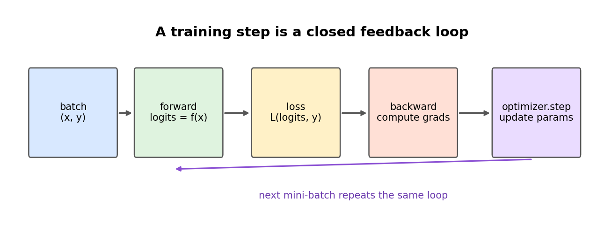

# 第 0 节:MLP 与反向传播

> 本节目标:理解神经网络的最小闭环:输入经过可学习参数变成预测,loss 衡量预测错误,反向传播计算梯度,优化器更新参数。



---

## 0.1 神经网络在做什么?

最朴素地说,神经网络就是一个带参数的函数:

$$
\hat{y} = f_\theta(x)
$$

其中:

- $x$ 是输入,比如一张图片、一句话的 embedding、一个表格样本
- $\hat{y}$ 是模型预测
- $\theta$ 是所有可学习参数,比如权重矩阵和 bias

训练的目标是找到一组参数 $\theta$,让预测 $\hat{y}$ 尽量接近真实标签 $y$:

$$
\theta^\* = \arg\min_\theta \mathcal{L}(f_\theta(x), y)
$$

---

## 0.2 单个神经元

一个神经元可以写成:

$$
z = w^T x + b
$$

再接一个非线性激活函数:

$$
h = \phi(z)
$$

如果没有 $\phi$,多层线性变换仍然只是一个线性变换:

$$
W_2(W_1x) = (W_2W_1)x
$$

所以**非线性激活**是神经网络能表达复杂函数的关键。

常见激活函数:

| 激活 | 公式 | 直觉 |
|------|------|------|
| ReLU | $\max(0,x)$ | 负数截断,简单稳定 |
| Sigmoid | $\frac{1}{1+e^{-x}}$ | 输出压到 0-1 |
| Tanh | $\tanh(x)$ | 输出压到 -1 到 1 |
| GELU | $x\Phi(x)$ | Transformer 常见,平滑版门控感 |

---

## 0.3 从单层到 MLP

MLP(Multi-Layer Perceptron)就是多层全连接网络:

$$
h_1 = \phi(xW_1 + b_1)
$$

$$
h_2 = \phi(h_1W_2 + b_2)
$$

$$
\hat{y} = h_2W_3 + b_3
$$

如果输入 batch 为:

$$
X \in \mathbb{R}^{B \times D}
$$

第一层参数:

$$
W_1 \in \mathbb{R}^{D \times H}
$$

则输出:

$$
H_1 = XW_1 + b_1 \in \mathbb{R}^{B \times H}
$$

---

## 0.4 Loss:怎么衡量错了多少?

分类任务常用交叉熵。模型先输出 logits:

$$
z \in \mathbb{R}^{B \times C}
$$

softmax 变成概率:

$$
p_i = \frac{e^{z_i}}{\sum_{j=1}^{C} e^{z_j}}
$$

真实类别为 $y$ 时,单个样本的交叉熵是:

$$
\mathcal{L} = -\log p_y
$$

直觉:真实类别概率越接近 1,loss 越小;真实类别概率越接近 0,loss 越大。

---

## 0.5 反向传播到底在算什么?

训练需要知道每个参数该往哪个方向改。也就是计算:

$$
\frac{\partial \mathcal{L}}{\partial W_1},
\frac{\partial \mathcal{L}}{\partial b_1},
\frac{\partial \mathcal{L}}{\partial W_2},
\dots
$$

反向传播本质上就是链式法则。

假设:

$$
a = xW_1,\quad h = \phi(a),\quad \hat{y} = hW_2,\quad \mathcal{L} = \ell(\hat{y}, y)
$$

那么:

$$
\frac{\partial \mathcal{L}}{\partial W_2}
=
\frac{\partial \mathcal{L}}{\partial \hat{y}}
\frac{\partial \hat{y}}{\partial W_2}
$$

$$
\frac{\partial \mathcal{L}}{\partial W_1}
=
\frac{\partial \mathcal{L}}{\partial \hat{y}}
\frac{\partial \hat{y}}{\partial h}
\frac{\partial h}{\partial a}
\frac{\partial a}{\partial W_1}
$$

越靠前的层,梯度要穿过越长的链。

📌 这会在 RNN 里变得非常重要:序列很长时,梯度链条也很长,就容易梯度消失或爆炸。

---

## 0.6 梯度下降

有了梯度后,最简单的更新规则是:

$$
\theta \leftarrow \theta - \eta \nabla_\theta \mathcal{L}
$$

其中 $\eta$ 是 learning rate。

现代训练通常用 Adam/AdamW,但核心直觉还是一样:沿着让 loss 下降的方向更新参数。

---

## 0.7 PyTorch 代码骨架

```python
import torch
import torch.nn as nn
import torch.nn.functional as F

class MLP(nn.Module):
    def __init__(self, input_dim, hidden_dim, num_classes):
        super().__init__()
        self.net = nn.Sequential(
            nn.Linear(input_dim, hidden_dim),
            nn.ReLU(),
            nn.Linear(hidden_dim, hidden_dim),
            nn.ReLU(),
            nn.Linear(hidden_dim, num_classes),
        )

    def forward(self, x):
        return self.net(x)

model = MLP(input_dim=784, hidden_dim=256, num_classes=10)
optimizer = torch.optim.AdamW(model.parameters(), lr=1e-3)

x = torch.randn(32, 784)
y = torch.randint(0, 10, (32,))

logits = model(x)
loss = F.cross_entropy(logits, y)

optimizer.zero_grad()
loss.backward()
optimizer.step()
```

---

## 0.8 本节核心要点

1. 神经网络是带参数的函数 $f_\theta(x)$。
2. 线性层负责可学习变换,激活函数提供非线性表达能力。
3. MLP 是多层全连接层和激活函数的组合。
4. loss 把"预测好不好"变成一个可优化的标量。
5. 反向传播用链式法则计算每个参数的梯度。
6. 优化器根据梯度更新参数,让 loss 逐步下降。

## 思考题

<details>
<summary>如果没有激活函数,10 层 MLP 会比 1 层线性层更强吗?</summary>

不会。多个线性变换复合后仍然是线性变换:

$$
W_{10}W_9\cdots W_1x = W'x
$$

所以没有非线性时,堆深度不会带来本质表达能力提升。

</details>
