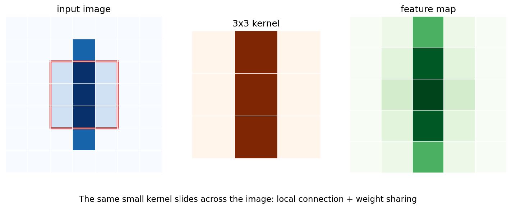

# 第 1 节:CNN 卷积神经网络

> 本节目标:理解卷积神经网络如何利用"局部连接"和"权重共享"处理图像,以及卷积核、通道、padding、stride 的形状变化。



---

## 1.1 为什么图片不适合直接用 MLP?

假设一张 RGB 图片大小为 $224 \times 224 \times 3$。如果直接展平:

$$
D = 224 \times 224 \times 3 = 150528
$$

接一个 hidden size 为 1024 的全连接层,参数量是:

$$
150528 \times 1024 \approx 1.54 \times 10^8
$$

这还只是第一层。

更重要的是,图片有两个强结构:

1. **局部性**:边缘、纹理、角点通常由相邻像素决定。
2. **平移共享**:同一个边缘检测器可以在图片任何位置复用。

CNN 就是把这两个假设写进网络结构。

---

## 1.2 卷积核在做什么?

对单通道输入 $X$ 和 $3 \times 3$ 卷积核 $K$,输出位置 $(i,j)$ 为:

$$
Y_{i,j} = \sum_{u=0}^{2}\sum_{v=0}^{2} K_{u,v} X_{i+u,j+v}
$$

直觉:卷积核像一个小窗口,在图片上滑动,每到一个位置就做一次局部加权求和。

不同卷积核可以学不同模式:

| 卷积核可能学到 | 对应视觉模式 |
|---------------|-------------|
| 水平边缘 | 上下亮度变化 |
| 垂直边缘 | 左右亮度变化 |
| 纹理 | 重复局部图案 |
| 局部形状 | 角点、曲线、小部件 |

---

## 1.3 多通道卷积

真实输入通常有多个通道:

$$
X \in \mathbb{R}^{C_{\text{in}} \times H \times W}
$$

一个卷积核也必须覆盖所有输入通道:

$$
K \in \mathbb{R}^{C_{\text{in}} \times k_h \times k_w}
$$

如果有 $C_{\text{out}}$ 个卷积核,输出就是:

$$
Y \in \mathbb{R}^{C_{\text{out}} \times H_{\text{out}} \times W_{\text{out}}}
$$

参数量:

$$
C_{\text{out}} \times C_{\text{in}} \times k_h \times k_w
$$

注意它不直接依赖输入图片的 $H,W$,这就是 CNN 参数高效的原因。

---

## 1.4 Padding 与 Stride

输出空间尺寸:

$$
H_{\text{out}} =
\left\lfloor
\frac{H + 2P - K}{S}
\right\rfloor + 1
$$

$$
W_{\text{out}} =
\left\lfloor
\frac{W + 2P - K}{S}
\right\rfloor + 1
$$

其中:

- $P$ 是 padding,在边缘补 0
- $K$ 是 kernel size
- $S$ 是 stride,窗口每次移动几格

常见设置:

| 设置 | 效果 |
|------|------|
| $K=3,P=1,S=1$ | 保持高宽不变 |
| $K=3,P=0,S=1$ | 高宽各减少 2 |
| $K=3,P=1,S=2$ | 高宽约减半 |

---

## 1.5 Pooling 与下采样

Pooling 常用于降低空间尺寸:

$$
Y_{i,j} = \max_{(u,v)\in \text{window}} X_{i+u,j+v}
$$

MaxPool 的直觉是:只保留局部区域里最强的响应。

现代 CNN 也常用 stride convolution 直接下采样,不一定单独使用 pooling。

---

## 1.6 一个 CNN 分类器骨架

```python
import torch
import torch.nn as nn

class SmallCNN(nn.Module):
    def __init__(self, num_classes=10):
        super().__init__()
        self.features = nn.Sequential(
            nn.Conv2d(3, 32, kernel_size=3, padding=1),
            nn.BatchNorm2d(32),
            nn.ReLU(),
            nn.MaxPool2d(2),  # 32x32 -> 16x16

            nn.Conv2d(32, 64, kernel_size=3, padding=1),
            nn.BatchNorm2d(64),
            nn.ReLU(),
            nn.MaxPool2d(2),  # 16x16 -> 8x8
        )
        self.classifier = nn.Sequential(
            nn.Flatten(),
            nn.Linear(64 * 8 * 8, 256),
            nn.ReLU(),
            nn.Linear(256, num_classes),
        )

    def forward(self, x):
        x = self.features(x)
        return self.classifier(x)

x = torch.randn(8, 3, 32, 32)
model = SmallCNN()
logits = model(x)
print(logits.shape)  # (8, 10)
```

---

## 1.7 CNN 的层级表示

CNN 越往深层,感受野越大:

| 层级 | 常见特征 |
|------|----------|
| 浅层 | 边缘、颜色、纹理 |
| 中层 | 局部形状、部件 |
| 深层 | 物体级语义 |

这和 MLP 最大的区别是:CNN 的结构先验强烈鼓励模型先学局部模式,再逐步组合成高级语义。

---

## 1.8 本节核心要点

1. CNN 利用局部连接和权重共享处理图像。
2. 卷积核参数量与输入空间尺寸不直接绑定。
3. 多通道卷积会在通道维度上一起加权求和。
4. padding 控制边界,stride 控制下采样速度。
5. 深层 CNN 通过堆叠卷积逐渐扩大感受野。
6. CNN 适合具有局部空间结构的数据,不只限于图片。

## 思考题

<details>
<summary>为什么同一个卷积核可以在整张图片上复用?</summary>

因为很多视觉模式具有平移共享性质。比如"垂直边缘"无论出现在左上角还是右下角,局部像素关系是相似的。卷积核复用就是把这个先验直接写进模型。

</details>
