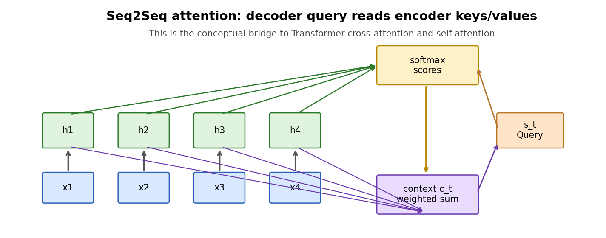

# 第 10 节:Seq2Seq 与 Attention 过渡

> 本节目标:理解传统 Encoder-Decoder RNN 为什么需要 attention,以及 attention 如何从"固定长度瓶颈"一步步引出 Transformer。



---

## 10.1 Seq2Seq 要解决什么?

很多任务输入和输出都是序列,但长度不一定相同:

- 机器翻译:中文句子 → 英文句子
- 摘要:长文档 → 短摘要
- 语音识别:音频帧 → 文本 token

传统 Seq2Seq 使用两个 RNN:

1. Encoder 读完整个输入序列
2. Decoder 根据 encoder 的表示逐步生成输出序列

---

## 10.2 固定长度瓶颈

最朴素的做法只把 encoder 最后一个 hidden state 交给 decoder:

$$
c = h_T^{\text{enc}}
$$

然后 decoder 生成:

$$
s_t = \text{RNN}(y_{t-1}, s_{t-1}, c)
$$

问题是:无论输入多长,都要压进一个固定向量 $c$。

这对长句子很难。早期信息可能在 encoder 末尾已经被压缩丢了。

---

## 10.3 Attention 的核心想法

不要只给 decoder 一个固定向量,而是让 decoder 每一步都回头看 encoder 的所有 hidden states:

$$
h_1^{\text{enc}}, h_2^{\text{enc}}, \dots, h_T^{\text{enc}}
$$

在 decoder 第 $t$ 步,根据当前 decoder state $s_t$ 计算每个 encoder state 的相关性:

$$
e_{t,i} = \text{score}(s_t, h_i^{\text{enc}})
$$

归一化成权重:

$$
\alpha_{t,i} =
\frac{\exp(e_{t,i})}{\sum_{j=1}^{T}\exp(e_{t,j})}
$$

加权求和得到上下文:

$$
c_t = \sum_{i=1}^{T}\alpha_{t,i}h_i^{\text{enc}}
$$

---

## 10.4 Query、Key、Value 的影子

如果用现代 Q/K/V 语言翻译:

| Seq2Seq attention | Q/K/V 视角 |
|------------------|------------|
| decoder 当前状态 $s_t$ | Query |
| encoder hidden state $h_i$ 用来匹配 | Key |
| encoder hidden state $h_i$ 被加权读出 | Value |

也就是:

$$
q_t = W_Q s_t
$$

$$
k_i = W_K h_i^{\text{enc}},\quad v_i = W_V h_i^{\text{enc}}
$$

$$
c_t = \text{softmax}\left(\frac{q_tK^T}{\sqrt{d}}\right)V
$$

这已经非常接近 Transformer 的 cross-attention。

---

## 10.5 Self-Attention 的跳跃

Seq2Seq attention 是:

> decoder 位置去看 encoder 位置。

Self-attention 则是:

> 同一个序列内部,每个位置都去看其他位置。

也就是让输入序列自己产生 Q/K/V:

$$
Q = XW_Q,\quad K = XW_K,\quad V = XW_V
$$

$$
\text{Attention}(X)=
\text{softmax}\left(\frac{QK^T}{\sqrt{d_k}}\right)V
$$

Transformer 的关键就是:用 self-attention 取代 RNN 的串行 hidden state 传递。

---

## 10.6 PyTorch 代码骨架

下面是一个最小 additive attention 形式,用于理解 Seq2Seq attention 的数据流:

```python
import torch
import torch.nn as nn
import torch.nn.functional as F

class AdditiveAttention(nn.Module):
    def __init__(self, enc_dim, dec_dim, attn_dim):
        super().__init__()
        self.w_enc = nn.Linear(enc_dim, attn_dim, bias=False)
        self.w_dec = nn.Linear(dec_dim, attn_dim, bias=False)
        self.v = nn.Linear(attn_dim, 1, bias=False)

    def forward(self, enc_outputs, dec_state, mask=None):
        # enc_outputs: (B, T, enc_dim)
        # dec_state: (B, dec_dim)
        scores = self.v(torch.tanh(
            self.w_enc(enc_outputs) + self.w_dec(dec_state)[:, None, :]
        )).squeeze(-1)  # (B, T)

        if mask is not None:
            scores = scores.masked_fill(mask == 0, float("-inf"))

        weights = F.softmax(scores, dim=-1)
        context = weights[:, None, :] @ enc_outputs
        return context.squeeze(1), weights
```

---

## 10.7 从 RNN Attention 到 Transformer

| 阶段 | 关键思想 | 瓶颈 |
|------|----------|------|
| RNN Encoder-Decoder | 用 hidden state 传递序列信息 | 固定长度瓶颈 |
| RNN + Attention | decoder 每步动态读取 encoder states | RNN 仍串行 |
| Self-Attention | 序列内部所有位置直接交互 | attention 二次复杂度 |
| Transformer | 完全堆叠 attention + FFN | 长上下文成本高 |

所以 Transformer 不是突然冒出来的。它是沿着这个方向走到极致:

> 既然 attention 这么有用,那能不能把 RNN 整个拿掉?

---

## 10.8 本节核心要点

1. Seq2Seq 用 encoder 读输入、decoder 生成输出。
2. 固定长度上下文向量会成为长序列瓶颈。
3. Attention 让 decoder 每一步动态读取 encoder 所有位置。
4. Seq2Seq attention 已经包含 Q/K/V 的雏形。
5. Self-attention 把"跨序列读取"推广成"序列内部互相读取"。
6. Transformer 可以看成 attention 思想替代 RNN 后的完整架构。

## 思考题

<details>
<summary>Attention 为什么能缓解固定长度瓶颈?</summary>

因为 decoder 不再只依赖一个压缩向量 $c$,而是每一步都能从 encoder 的所有 hidden states 中按权重读取信息。输入序列的细节不必全部挤进最后一个 hidden state。

</details>
