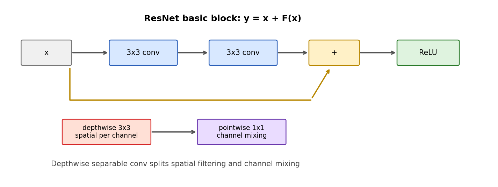

# 第 11 节:现代 CNN Block

> 本节目标:在基础 CNN 之后,继续理解 1x1 卷积、残差块、深度可分离卷积、全局平均池化这些现代 CNN 常见结构。



---

## 11.1 为什么还要看现代 CNN?

基础 CNN 已经有:

- Conv
- ReLU
- Pooling
- Linear classifier

但真实 CNN 架构会大量使用更高效、更深、更稳定的 block,比如 ResNet、MobileNet、ConvNeXt。

理解这些 block,有助于看懂图像模型,也能反过来理解 Transformer 里的残差、归一化、通道混合等思想。

---

## 11.2 1x1 卷积

1x1 卷积看起来没有空间窗口,但它会混合通道:

$$
Y_{c_{\text{out}}, h, w}
=
\sum_{c_{\text{in}}}
W_{c_{\text{out}},c_{\text{in}}}
X_{c_{\text{in}},h,w}
$$

它等价于对每个空间位置单独做一个线性层。

常见用途:

| 用途 | 说明 |
|------|------|
| 降维 | 减少通道数,降低后续卷积成本 |
| 升维 | 增强通道表达能力 |
| 通道混合 | 在不改变高宽的情况下融合通道信息 |

---

## 11.3 ResNet 残差块

ResNet block 的核心:

$$
y = x + F(x)
$$

一个 basic block:

```text
x -> Conv3x3 -> BN -> ReLU -> Conv3x3 -> BN -> + -> ReLU
|                                             ^
|_____________________________________________|
```

如果输入输出通道不同,或空间尺寸变化,shortcut 也需要投影:

$$
y = W_s x + F(x)
$$

其中 $W_s$ 常用 1x1 卷积实现。

---

## 11.4 Bottleneck Block

ResNet bottleneck 用三层卷积:

```text
1x1 降维 -> 3x3 空间卷积 -> 1x1 升维
```

例如通道变化:

$$
256 \rightarrow 64 \rightarrow 64 \rightarrow 256
$$

这样中间昂贵的 3x3 卷积只在较小通道数上做,参数和计算量都更省。

---

## 11.5 Depthwise Separable Convolution

普通卷积参数量:

$$
C_{\text{out}} \times C_{\text{in}} \times k \times k
$$

Depthwise separable convolution 分两步:

1. depthwise conv:每个输入通道单独做 $k \times k$ 空间卷积
2. pointwise conv:用 1x1 卷积混合通道

参数量约为:

$$
C_{\text{in}} \times k \times k
+
C_{\text{out}} \times C_{\text{in}}
$$

MobileNet 大量使用这种结构。

直觉:

> 先分别处理每个通道的空间模式,再用 1x1 卷积做通道融合。

---

## 11.6 Global Average Pooling

早期 CNN 常把 feature map flatten 后接大 MLP。

现代 CNN 更常用 global average pooling:

$$
z_c = \frac{1}{HW}\sum_{h=1}^{H}\sum_{w=1}^{W}X_{c,h,w}
$$

它把:

$$
X \in \mathbb{R}^{C \times H \times W}
$$

变成:

$$
z \in \mathbb{R}^{C}
$$

好处:

- 参数少
- 降低过拟合
- 输入尺寸更灵活

---

## 11.7 PyTorch 代码骨架

```python
import torch
import torch.nn as nn

class BasicBlock(nn.Module):
    def __init__(self, in_ch, out_ch, stride=1):
        super().__init__()
        self.conv1 = nn.Conv2d(in_ch, out_ch, 3, stride=stride, padding=1, bias=False)
        self.bn1 = nn.BatchNorm2d(out_ch)
        self.conv2 = nn.Conv2d(out_ch, out_ch, 3, padding=1, bias=False)
        self.bn2 = nn.BatchNorm2d(out_ch)
        self.act = nn.ReLU(inplace=True)

        if in_ch != out_ch or stride != 1:
            self.shortcut = nn.Sequential(
                nn.Conv2d(in_ch, out_ch, 1, stride=stride, bias=False),
                nn.BatchNorm2d(out_ch),
            )
        else:
            self.shortcut = nn.Identity()

    def forward(self, x):
        residual = self.shortcut(x)
        y = self.act(self.bn1(self.conv1(x)))
        y = self.bn2(self.conv2(y))
        return self.act(y + residual)

class DepthwiseSeparableConv(nn.Module):
    def __init__(self, in_ch, out_ch, kernel_size=3):
        super().__init__()
        padding = kernel_size // 2
        self.net = nn.Sequential(
            nn.Conv2d(in_ch, in_ch, kernel_size, padding=padding, groups=in_ch),
            nn.Conv2d(in_ch, out_ch, 1),
            nn.BatchNorm2d(out_ch),
            nn.ReLU(inplace=True),
        )

    def forward(self, x):
        return self.net(x)
```

---

## 11.8 CNN 与 Transformer 的一点对照

| CNN | Transformer |
|-----|-------------|
| 3x3 卷积混合局部空间信息 | attention 混合 token 间信息 |
| 1x1 卷积混合通道信息 | FFN/MLP 混合 hidden 维度 |
| 残差块 | Transformer block 残差 |
| BatchNorm | LayerNorm/RMSNorm |
| 全局平均池化 | CLS token / pooling |

它们不是同一种结构,但很多工程思想是相通的:稳定训练、逐层组合、局部或全局信息混合、用残差保护信息流。

---

## 11.9 本节核心要点

1. 1x1 卷积用于通道混合和升/降维。
2. ResNet block 用残差连接让 CNN 可以堆得很深。
3. Bottleneck block 用 1x1-3x3-1x1 降低计算成本。
4. Depthwise separable convolution 把空间卷积和通道混合拆开,效率更高。
5. Global average pooling 减少 classifier 参数量。
6. 现代 CNN 与 Transformer 在残差、归一化、通道混合等思想上有很多呼应。

## 思考题

<details>
<summary>1x1 卷积为什么不是"没用的卷积"?</summary>

因为它虽然不混合空间邻域,但会在每个空间位置混合通道。它相当于对每个像素位置做共享的线性层,可以用于升维、降维和通道信息融合。

</details>
