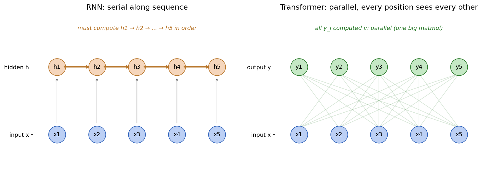

# 第 0 节:为什么需要 Transformer?

## 0.1 RNN 时代的序列建模

在 Transformer 出现(2017)之前,处理序列数据(机器翻译、语言建模等)的主流是 **循环神经网络(RNN)** 及其改进版 LSTM、GRU。

它的核心递推公式是:

$$
h_t = f(h_{t-1}, x_t)
$$

含义:**第 $t$ 时刻的隐藏状态 $h_t$ 由上一时刻状态 $h_{t-1}$ 和当前输入 $x_t$ 共同决定**。

以语言模型为例,要建模 "I love deep learning" 这句话,RNN 是这样推进的:

```
x_1 = "I"       → h_1
x_2 = "love"    → h_2 = f(h_1, x_2)
x_3 = "deep"    → h_3 = f(h_2, x_3)
x_4 = "learning"→ h_4 = f(h_3, x_4)
```

这种"链式"结构带来两个**致命问题**。

---

## 0.2 问题 1:无法并行

要算 $h_4$,必须先算 $h_3$;要算 $h_3$,必须先算 $h_2$ …… 这是一个**严格的串行依赖链**。

在 GPU 时代,这是灾难性的。GPU 擅长的是**大批量并行矩阵乘法**(比如一次性算一个 $1024 \times 4096$ 的矩阵乘),而 RNN 的递推强制让计算无法并行展开。

形式化地说,设序列长度为 $n$,单步计算时间为 $O(d^2)$($d$ 是隐藏维度),那么:

- RNN 总时间:$O(n \cdot d^2)$,**沿序列维(时间步)无法并行**,只能串行 $n$ 次
- Transformer 总时间:$O(n^2 \cdot d)$,**沿序列维完全可以并行**(一次大矩阵乘搞定)

⚠️ 注意:RNN 仍然可以在 **batch 维**并行(同时处理多条样本的同一个时间步),GPU 在这个维度上能跑满。但**序列内部的 $n$ 个时间步必须串行**,这是和 Transformer 的本质差距。当 $n$ 不大、$d$ 很大时(实际场景),Transformer 的有效并行度更高、墙钟时间更短。

---

## 0.3 问题 2:长程依赖衰减

考虑这个翻译任务:

> The animal didn't cross the street because **it** was too tired.

要正确翻译 "it",模型需要知道 "it" 指代的是 "animal" 还是 "street"。

在 RNN 中,信息从 "animal"(位置 2)传到 "it"(位置 8)要**经过 6 次非线性变换**。每一次变换都涉及 sigmoid/tanh 的导数(最大值 0.25 / 1),反向传播时梯度连乘,极易**消失**(或爆炸):

$$
\frac{\partial \mathcal{L}}{\partial h_2} = \frac{\partial \mathcal{L}}{\partial h_8} \cdot \prod_{t=3}^{8} \frac{\partial h_t}{\partial h_{t-1}}
$$

LSTM 的门控机制(遗忘门、输入门)缓解了这个问题,但**没有根治** — 当序列长度达到几百时,效果依然显著下降。

---

## 0.4 Transformer 的解法:一次性"看见"所有位置

Transformer 完全抛弃递归。对一个长度为 $n$ 的序列 $X = [x_1, x_2, \dots, x_n]$,它用 **注意力机制(Attention)** 让**每个位置直接和其他所有位置交互**:

$$
y_i = \sum_{j=1}^{n} \alpha_{ij} \cdot v_j
$$

其中:
- $v_j$ 是位置 $j$ 的"值"向量(后面会推导怎么算)
- $\alpha_{ij} \in [0, 1]$ 是位置 $i$ 对位置 $j$ 的"注意力权重",且 $\sum_j \alpha_{ij} = 1$

直观地说:**$y_i$ 是所有 $v_j$ 的加权平均,权重由 $i$ 和 $j$ 之间的"相关性"决定。**

<div align="center"></div>

图:RNN(左)的隐藏状态必须按时间步串行计算;Transformer(右)每个输出位置都直接连到所有输入位置,可以一次大矩阵乘并行算出来。

---

## 0.5 这种设计的三个关键优势

### 优势 1:完全并行

注意所有 $y_i$ 的计算只依赖输入 $X$,**彼此之间没有依赖**。这意味着 $y_1, y_2, \dots, y_n$ 可以**同时算出来** — 一次大矩阵乘法就够了。

### 优势 2:任意两个位置的距离都是 1

在 RNN 中,位置 $i$ 和位置 $j$ 之间的"信息距离"是 $|i - j|$(要走这么多步)。

在 Attention 中,任意两个位置之间的距离都是 **1**(直接连接)。这意味着梯度反向传播时**只有一次乘法**,不会消失。

### 优势 3:可解释性

注意力权重 $\alpha_{ij}$ 是可见的,我们可以画热力图看模型在"关注什么":

```
        I    love  deep  learning
I      [0.7  0.1   0.1   0.1 ]
love   [0.2  0.6   0.1   0.1 ]
deep   [0.1  0.1   0.5   0.3 ]
learn  [0.1  0.1   0.4   0.4 ]
```

---

## 0.6 代价:$O(n^2)$ 复杂度

Transformer 不是免费的午餐。注意 $\alpha_{ij}$ 是一个 $n \times n$ 的矩阵 — 每一对 $(i, j)$ 都要算一次。所以:

| 维度 | RNN | Transformer |
|------|-----|-------------|
| 时间复杂度 | $O(n \cdot d^2)$ | $O(n^2 \cdot d)$ |
| 空间复杂度 | $O(n \cdot d)$ | $O(n^2 + n \cdot d)$ |
| 并行性 | ❌ | ✅ |
| 长程梯度 | 衰减 | 不衰减 |

当 $n$ 极大时(比如几万 token 的长文本),$O(n^2)$ 会变得非常昂贵。这也是后续大量变种(Linformer、Longformer、FlashAttention、Mamba 等)要优化的核心问题。

---

## 0.7 本节核心要点

1. **RNN 的两大致命伤**:串行计算无法并行 + 长程依赖梯度消失。
2. **Transformer 的核心思想**:用全局注意力代替递归,让每个位置直接看见所有其他位置。
3. **代价**:$O(n^2)$ 复杂度,但换来了并行能力和短梯度路径。
4. **关键公式预告**:$y_i = \sum_j \alpha_{ij} v_j$,其中 $\alpha_{ij}$ 怎么算就是下一节的核心。

---

## 0.8 下一节预告

下一节我们要回答:
- $\alpha_{ij}$ 到底怎么算?
- 论文中的 Q、K、V 三个矩阵是什么含义?
- 为什么 Attention 公式里要除以 $\sqrt{d_k}$?
- 这个公式怎么用一次矩阵乘法算出来?

→ [第 1 节:Self-Attention 的数学推导](01-self-attention.md)
