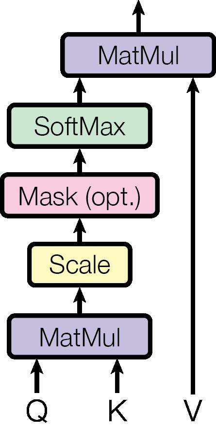

# 第 1 节:Self-Attention 的数学推导

> 本节目标:从"加权平均"的直觉出发,推导出论文中的完整公式
> $$\text{Attention}(Q, K, V) = \text{softmax}\left(\frac{QK^T}{\sqrt{d_k}}\right) V$$
> 并且**每一个符号、每一步操作的动机都要说清楚**。

---

## 1.1 从上一节的"半成品"开始

上一节我们得到了:

$$
y_i = \sum_{j=1}^{n} \alpha_{ij} \cdot v_j
$$

但留下了三个未解之谜:
1. $v_j$ 是什么?它和原始输入 $x_j$ 是什么关系?
2. $\alpha_{ij}$ 怎么算?
3. 为什么这样设计是合理的?

我们一个一个解决。

---

## 1.2 直觉:数据库查询的类比

注意力机制其实在模仿**字典/数据库查询**:

```python
# Python 字典查询
result = my_dict[query_key]
```

字典查询是"精确匹配":给一个 key,要么完全匹配,要么不匹配。

而 **Attention 是"软匹配"(soft lookup)**:给一个 query,看它和**所有 key 的相似度**,然后**按相似度加权地取回所有 value**。

这就引出了三个核心概念:

| 角色 | 直觉含义 |
|------|---------|
| **Query ($q$)** | 我现在想"问"什么?(当前位置要找的信息) |
| **Key ($k$)** | 我能"回答"什么?(每个位置的"索引") |
| **Value ($v$)** | 我"包含"什么实际信息?(每个位置的"内容") |

注意:**同一个输入 $x_i$ 同时扮演三个角色**(query, key, value),只是用三个不同的"投影"看它。这就是 "self-attention" 中 "self" 的含义 — 一个序列对自己做注意力。

---

## 1.3 从输入到 Q、K、V:三个线性投影

设输入序列嵌入矩阵为:

$$
X \in \mathbb{R}^{n \times d_{\text{model}}}
$$

其中 $n$ 是序列长度,$d_{\text{model}}$ 是每个 token 的嵌入维度(论文中 $=512$)。

我们引入三个**可学习的投影矩阵**:

$$
W^Q \in \mathbb{R}^{d_{\text{model}} \times d_k}, \quad
W^K \in \mathbb{R}^{d_{\text{model}} \times d_k}, \quad
W^V \in \mathbb{R}^{d_{\text{model}} \times d_v}
$$

然后计算:

$$
Q = X W^Q, \quad K = X W^K, \quad V = X W^V
$$

它们的形状是:

$$
Q \in \mathbb{R}^{n \times d_k}, \quad K \in \mathbb{R}^{n \times d_k}, \quad V \in \mathbb{R}^{n \times d_v}
$$

**为什么需要这三个投影?** 因为 $X$ 自己只是"原始嵌入"。我们希望让模型**学会**:
- "作为 query 时,我应该突出哪些特征?" → $W^Q$
- "作为 key 时,我应该暴露哪些特征,让别人能找到我?" → $W^K$
- "作为 value 时,我应该传递哪些实际信息?" → $W^V$

这三个不同的"视角"是 Self-Attention 灵活性的核心来源。如果不做投影,直接用 $X$ 自己点积自己,$\alpha$ 矩阵会高度对称且不灵活。

---

## 1.4 注意力分数:点积相似度

接下来的问题:有了 query $q_i \in \mathbb{R}^{d_k}$ 和 key $k_j \in \mathbb{R}^{d_k}$,怎么衡量它们的相似度?

最常见的有两种选择:

1. **加性注意力(additive)**:$\text{score}(q, k) = w^T \tanh(W_1 q + W_2 k)$ — 需要额外参数,慢
2. **点积注意力(dot-product)**:$\text{score}(q, k) = q^T k$ — **无额外参数,可并行**

Transformer 选择**点积**,因为它可以写成大矩阵乘法,完美贴合 GPU:

$$
S = QK^T \in \mathbb{R}^{n \times n}
$$

矩阵 $S$ 的元素 $S_{ij} = q_i^T k_j$ 就是位置 $i$ 的 query 和位置 $j$ 的 key 的相似度分数。

⚠️ **关键观察**:点积越大,表示两个向量"方向越一致";越小(或负)则越无关。这正是我们想要的相似度衡量。

---

## 1.5 关键问题:为什么要除以 $\sqrt{d_k}$?

这是论文公式里最容易被忽略但**极其重要**的细节。论文原话(3.2.1 节)是:

> We suspect that for large values of $d_k$, the dot products grow large in magnitude, pushing the softmax function into regions where it has extremely small gradients.

我们来**严格推导**这一点。

### 假设和符号

我们要分析的是**投影后的** $q = x W^Q$ 和 $k = x W^K$ 的元素。假设 $q, k \in \mathbb{R}^{d_k}$,且它们的每个分量都是**独立同分布(i.i.d.)**,均值为 0、方差为 1:

$$
\mathbb{E}[q_l] = \mathbb{E}[k_l] = 0, \quad \text{Var}(q_l) = \text{Var}(k_l) = 1, \quad \forall l = 1, \dots, d_k
$$

⚠️ **关于假设的合理性**:这不是对原始输入 $x$ 的假设,而是对投影后 Q/K 的统计性质。在以下条件下近似成立:
- $x$ 经过 LayerNorm(每个 token 的特征均值 0、方差 1)
- $W^Q, W^K$ 用 Xavier / Kaiming 初始化(让线性变换保持方差量级)
- 此时 $q_l = \sum_m x_m W^Q_{ml}$ 在中心极限定理下近似 $\mathcal{N}(0, 1)$

实际训练中由于非线性、残差等因素,这只是一阶近似,但对解释**为什么需要缩放**已经足够。

### 推导点积的方差

点积是:

$$
q^T k = \sum_{l=1}^{d_k} q_l \cdot k_l
$$

由 $q_l$ 和 $k_l$ 独立且均值 0,有:

$$
\mathbb{E}[q_l \cdot k_l] = \mathbb{E}[q_l] \cdot \mathbb{E}[k_l] = 0
$$

$$
\text{Var}(q_l \cdot k_l) = \mathbb{E}[(q_l k_l)^2] - 0 = \mathbb{E}[q_l^2] \cdot \mathbb{E}[k_l^2] = 1 \cdot 1 = 1
$$

由独立性,方差可加:

$$
\text{Var}(q^T k) = \sum_{l=1}^{d_k} \text{Var}(q_l \cdot k_l) = d_k
$$

也就是说,**点积的标准差是 $\sqrt{d_k}$**。

### 为什么这是个问题?

当 $d_k = 64$ 时,点积的典型值可能在 $\pm 8$ 量级;当 $d_k = 512$ 时,点积可能达到 $\pm 23$ 量级。

把这种大值送进 softmax 会怎样?

$$
\text{softmax}(s_1, s_2, \dots, s_n)_i = \frac{e^{s_i}}{\sum_j e^{s_j}}
$$

当某个 $s_i$ 远大于其他所有 $s_j$ 时,softmax 输出会**接近 one-hot**(几乎所有质量集中在一个位置)。

这有两个坏后果:
1. **梯度几乎为零**:在 one-hot 区域,softmax 的 Jacobian 矩阵元素接近 0,反向传播没东西可学
2. **失去"软"加权的意义**:Attention 退化成"硬选择",失去了对多个位置加权融合的能力

### 解法:缩放

除以 $\sqrt{d_k}$,把方差从 $d_k$ 拉回 **1**:

$$
\text{Var}\left(\frac{q^T k}{\sqrt{d_k}}\right) = \frac{d_k}{d_k} = 1
$$

这样不管 $d_k$ 是 64 还是 4096,送进 softmax 的分数始终在相似的量级,softmax 保持"软"且梯度健康。

📌 **这就是 "Scaled" Dot-Product Attention 中 "Scaled" 的来源**。

---

## 1.6 Softmax 归一化

有了缩放后的分数矩阵 $\frac{QK^T}{\sqrt{d_k}}$,我们沿**每一行**做 softmax:

$$
A = \text{softmax}\left(\frac{QK^T}{\sqrt{d_k}}\right) \in \mathbb{R}^{n \times n}
$$

也就是 $A_{ij} = \alpha_{ij}$,满足:

$$
\alpha_{ij} \geq 0, \quad \sum_{j=1}^{n} \alpha_{ij} = 1
$$

含义:**对于每个 query 位置 $i$,它对所有 key 位置 $j$ 的注意力权重是一个概率分布**(总和为 1)。

⚠️ 注意是**按行**做 softmax,不是按列也不是整个矩阵。每一行代表一个 query 对所有 key 的"关注分布"。

---

## 1.7 加权求和:得到输出

最后用注意力权重对 value 加权:

$$
\text{Attention}(Q, K, V) = A \cdot V = \text{softmax}\left(\frac{QK^T}{\sqrt{d_k}}\right) V \in \mathbb{R}^{n \times d_v}
$$

**矩阵乘法 $AV$ 的元素含义**:

$$
[AV]_{i,:} = \sum_{j=1}^{n} \alpha_{ij} \cdot v_j
$$

正好就是我们一开始想要的"加权平均"形式!输出 $\text{Attention}(Q,K,V)$ 的第 $i$ 行就是位置 $i$ 在融合了整个序列信息之后的新表示。

---

## 1.8 完整流程图(矩阵视角)

```
输入 X (n × d_model)
   │
   ├──→ X · W^Q ──→ Q (n × d_k)
   ├──→ X · W^K ──→ K (n × d_k)
   └──→ X · W^V ──→ V (n × d_v)

   Q · Kᵀ            →  S (n × n)         [点积相似度]
   S / √d_k          →  S' (n × n)        [缩放]
   softmax(S', dim=-1) → A (n × n)        [按行归一化]
   A · V             →  output (n × d_v)  [加权求和]
```

<div align="center"></div>

图:Scaled Dot-Product Attention 的计算路径。来源:Vaswani et al., 2017, *Attention Is All You Need*, Figure 2(left)。

---

## 1.9 论文符号对照

《Attention Is All You Need》3.2.1 节的原始公式:

$$
\text{Attention}(Q, K, V) = \text{softmax}\left(\frac{QK^T}{\sqrt{d_k}}\right) V
$$

逐项对应:
- $Q$:论文 = 我们推导的 $XW^Q$
- $K$:论文 = $XW^K$
- $V$:论文 = $XW^V$
- $d_k$:每个 key/query 向量的维度(论文中 $=64$,因为分了 8 个头)

⚠️ 论文中 $Q, K, V$ 已经是投影**之后**的矩阵,不要和 $X$ 混淆。

---

## 1.10 PyTorch 伪代码

```python
import torch
import torch.nn.functional as F

def scaled_dot_product_attention(Q, K, V):
    """
    Q: (batch, n, d_k)
    K: (batch, n, d_k)
    V: (batch, n, d_v)
    返回: (batch, n, d_v)
    """
    d_k = Q.size(-1)

    # 1. 点积相似度: (batch, n, n)
    scores = torch.matmul(Q, K.transpose(-2, -1))

    # 2. 缩放
    scores = scores / (d_k ** 0.5)

    # 3. 按最后一维(每行)做 softmax
    attn = F.softmax(scores, dim=-1)

    # 4. 加权求和: (batch, n, d_v)
    output = torch.matmul(attn, V)

    return output, attn
```

完整的 Self-Attention 层(包含线性投影):

```python
import torch.nn as nn

class SelfAttention(nn.Module):
    def __init__(self, d_model, d_k, d_v):
        super().__init__()
        self.W_q = nn.Linear(d_model, d_k, bias=False)
        self.W_k = nn.Linear(d_model, d_k, bias=False)
        self.W_v = nn.Linear(d_model, d_v, bias=False)

    def forward(self, x):
        # x: (batch, n, d_model)
        Q = self.W_q(x)  # (batch, n, d_k)
        K = self.W_k(x)  # (batch, n, d_k)
        V = self.W_v(x)  # (batch, n, d_v)
        return scaled_dot_product_attention(Q, K, V)
```

---

## 1.11 复杂度分析

| 步骤 | 时间复杂度 | 主要瓶颈 |
|------|----------|---------|
| 计算 Q, K, V | $O(n \cdot d_{\text{model}} \cdot d_k)$ | 大矩阵乘 |
| $QK^T$ | $O(n^2 \cdot d_k)$ | 序列越长越慢 |
| softmax | $O(n^2)$ | 内存瓶颈 |
| $A \cdot V$ | $O(n^2 \cdot d_v)$ | 序列越长越慢 |

**总复杂度**:$O(n^2 \cdot d)$(忽略常数)

这就是我们说 Transformer 是 $O(n^2)$ 的原因 — 主要来自 $QK^T$ 和 $AV$ 这两步。

---

## 1.12 本节核心要点

1. **三个投影 $W^Q, W^K, W^V$** 把同一个输入映射为"查询""索引""内容"三个视角
2. **点积**衡量相似度,且能写成大矩阵乘(GPU 友好)
3. **除以 $\sqrt{d_k}$** 是为了让点积方差保持 1,防止 softmax 进入饱和区
4. **按行 softmax** 让每个 query 对所有 key 的权重构成概率分布
5. **$AV$** 完成加权求和,得到融合了上下文的新表示
6. 完整公式:$\text{Attention}(Q,K,V) = \text{softmax}\left(\frac{QK^T}{\sqrt{d_k}}\right) V$

---

## 1.13 思考题(可选)

1. 如果不做 $\sqrt{d_k}$ 缩放,训练初期会发生什么?(提示:观察 softmax 输出的熵)
2. 为什么 $W^Q$ 和 $W^K$ 不共用一个矩阵?它们功能上对称,共享会损失什么?
3. Attention 中信息是"流"的,但**信息量**是怎么变的?$V$ 的维度选择(论文中 $d_v = d_k = 64$)有什么考量?

<details>
<summary><b>参考思路</b>(先自己想 5-10 分钟再展开)</summary>

**1.** 训练初期 $W^Q, W^K$ 是随机初始化的,$QK^T$ 的方差就是 $d_k$(见 1.5 节)。不缩放时 softmax 几乎变成 one-hot,熵接近 0;Jacobian 元素接近 0,梯度无法回传到 $W^Q, W^K$。表现:loss 卡住、训练不动。缩放后熵接近 $\log n$(均匀分布),梯度健康。

**2.** $Q$ 和 $K$ 是**不对称**的:$Q$ 是"我想问什么"(主动),$K$ 是"我能回答什么"(被动)。如果共享,$QK^T$ 会变成 $X W W^T X^T$,这是个**半正定对称矩阵** — 意味着 $\alpha_{ij} = \alpha_{ji}$(注意力强制对称),A 关注 B 时 B 也必须同等关注 A。语言中这显然不成立:"代词 it" 强烈关注它指代的名词,但名词不一定回头关注 it。

**3.** $V$ 维度决定每个 token 能"携带"多少信息进入加权平均。如果 $d_v$ 太小,信息瓶颈;太大,后续计算/参数膨胀。论文取 $d_v = d_k = d_{\text{model}}/h$ 是个工程平衡:每头的 $V$ 容量等于 Q/K 的"匹配能力"。把所有头 concat 后总维度回到 $d_{\text{model}}$,信息总量守恒。

</details>

---

## 1.14 下一节预告

我们已经有了 **一个** Attention 头。但论文为什么要用 **多头(Multi-Head)**?
- 多头到底"多"在哪里?
- 每个头看到的信息有什么不同?
- 怎么把多个头的输出合并回去?

→ [第 2 节:Multi-Head Attention](02-multi-head-attention.md)
