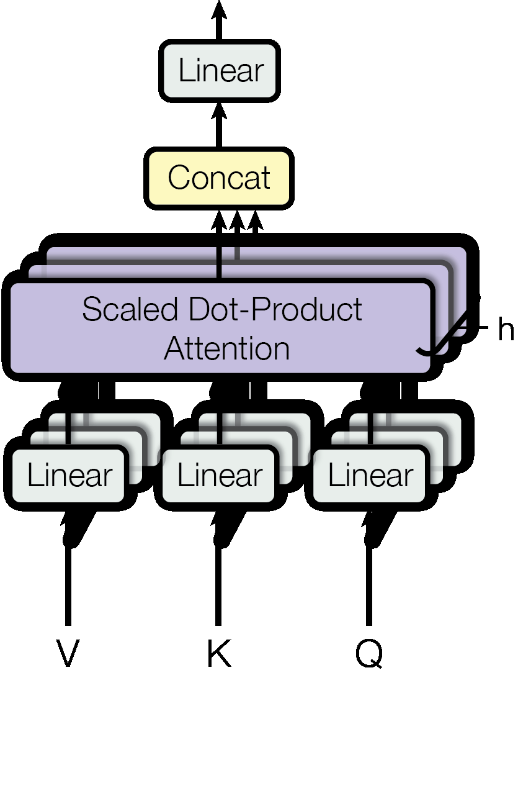

# 第 2 节:Multi-Head Attention

> 本节目标:理解为什么要把一个大 Attention 拆成多个并行的小 Attention,以及完整公式
> $$\text{MultiHead}(Q, K, V) = \text{Concat}(\text{head}_1, \dots, \text{head}_h) W^O$$

---

## 2.1 单头 Attention 的局限

回顾上一节:Self-Attention 给每个 query 位置算出一个**对所有位置的概率分布** $\alpha_{ij}$。

但这里有个问题:**每个位置只能产生一个分布**。

考虑这句话:

> The cat sat on the mat because **it** was tired.

对于 "it" 这个 token,我们可能希望模型同时关注:
- "cat"(语义指代 — "it" 指 "cat")
- "tired"(谓语关系 — 描述 "it" 的状态)
- "sat"(动作关系)

但单个 softmax 分布是**单峰的**(或者说"互斥的"):权重总和为 1,关注 "cat" 多了就只能关注 "tired" 少。**模型被迫在不同关系类型之间做权衡**。

更深层的问题:单个 $W^Q, W^K, W^V$ 投影只能让模型从**一个角度**理解"相似性"。但语言中的相似性是多维的 — 句法相似、语义相似、共指、时态对应…… 一个投影学不过来。

---

## 2.2 解决方案:并行多个"子空间"

Multi-Head Attention 的思想:

> **不要让一个 Attention 头身兼数职,而是开 $h$ 个独立的 Attention,各管一摊,最后合并。**

每个头(head)都有自己**独立的** $W^Q, W^K, W^V$,投影到一个**低维子空间**;然后在这个子空间里独立做一次 Scaled Dot-Product Attention;最后把所有头的输出拼起来再投影回去。

---

## 2.3 数学定义

设有 $h$ 个头(论文中 $h = 8$)。对第 $i$ 个头:

$$
\text{head}_i = \text{Attention}(Q W_i^Q, K W_i^K, V W_i^V)
$$

其中:
- $W_i^Q \in \mathbb{R}^{d_{\text{model}} \times d_k}$
- $W_i^K \in \mathbb{R}^{d_{\text{model}} \times d_k}$
- $W_i^V \in \mathbb{R}^{d_{\text{model}} \times d_v}$

注意每个头的输出维度是 $n \times d_v$。把 $h$ 个头**沿特征维拼接**:

$$
\text{Concat}(\text{head}_1, \dots, \text{head}_h) \in \mathbb{R}^{n \times (h \cdot d_v)}
$$

最后再用一个**输出投影矩阵** $W^O$ 把它映射回 $d_{\text{model}}$ 维:

$$
W^O \in \mathbb{R}^{(h \cdot d_v) \times d_{\text{model}}}
$$

完整公式:

$$
\boxed{\text{MultiHead}(Q, K, V) = \text{Concat}(\text{head}_1, \dots, \text{head}_h) \cdot W^O}
$$



图:Multi-Head Attention 会并行做 $h$ 个 Scaled Dot-Product Attention,再 concat 并投影。来源:Vaswani et al., 2017, *Attention Is All You Need*, Figure 2(right)。

输出形状:$n \times d_{\text{model}}$,与输入相同(这很重要,后面残差连接要用)。

---

## 2.4 关键设计选择:$d_k = d_v = d_{\text{model}} / h$

论文设定:

$$
d_k = d_v = \frac{d_{\text{model}}}{h}
$$

例如 $d_{\text{model}} = 512$, $h = 8$,则 $d_k = d_v = 64$。

**为什么这样设计?** — 让多头的总计算量约等于单头的"全维度"Attention。

### 计算量对比

**单头(全维度)** Attention:

- $W^Q$ 形状 $d_{\text{model}} \times d_{\text{model}}$,参数量 $\approx d_{\text{model}}^2$
- 三个矩阵总参数 $\approx 3 d_{\text{model}}^2$

**多头(每头 $d_k = d_{\text{model}}/h$)** Attention:

- 每个头的 $W_i^Q$ 形状 $d_{\text{model}} \times \frac{d_{\text{model}}}{h}$,参数量 $\approx d_{\text{model}}^2 / h$
- $h$ 个头总参数 $\approx h \cdot d_{\text{model}}^2 / h = d_{\text{model}}^2$
- 三个矩阵总参数 $\approx 3 d_{\text{model}}^2$
- 加上 $W^O$,$d_{\text{model}} \times d_{\text{model}}$,参数量 $\approx d_{\text{model}}^2$
- **总计 $\approx 4 d_{\text{model}}^2$**

📌 **关键结论**:Multi-Head Attention 的参数量和计算量都和"单头全维度"Attention 几乎相同(只多了一个 $W^O$),但**表达能力大幅增强**(从一个分布变成 $h$ 个分布)。这是免费的午餐!

---

## 2.5 每个头到底"看到"什么?

实证研究(如 Clark et al. 2019, *What Does BERT Look At?*)发现:

- **某些头专门跟踪句法关系**(比如"主语-动词"对应)
- **某些头跟踪共指**(指代消解)
- **某些头关注位置邻居**(本质上像 CNN 的局部窗口)
- **某些头几乎没用**(可以剪枝)

可视化举例(伪示意):

```
Head 1 (句法):         Head 2 (位置邻居):       Head 3 (共指):
   it                       it                       it
   ↓                        ↓                        ↓
[cat, sat, tired]      [was, tired]              [cat]
```

这就是为什么 Multi-Head 能力比单头强 — 它把"什么是相似"这个问题**分解成了多个并行的子问题**。

---

## 2.6 高效实现:不要真的循环 $h$ 次

天真地实现 Multi-Head 会写 $h$ 个独立的线性层,然后 for 循环:

```python
# ❌ 慢:实际不会这样写
heads = []
for i in range(h):
    Q_i = self.W_q_list[i](x)  # ...
    heads.append(attention(Q_i, K_i, V_i))
output = torch.cat(heads, dim=-1)
output = self.W_o(output)
```

真实实现是**一次大矩阵乘 + reshape**:

### 技巧:把 $h$ 个 $W_i^Q$ 拼成一个大矩阵

注意 $h$ 个 $W_i^Q \in \mathbb{R}^{d_{\text{model}} \times d_k}$ 横向拼起来,正好就是一个 $d_{\text{model}} \times (h \cdot d_k) = d_{\text{model}} \times d_{\text{model}}$ 的矩阵:

$$
W^Q_{\text{big}} = [W_1^Q \mid W_2^Q \mid \dots \mid W_h^Q] \in \mathbb{R}^{d_{\text{model}} \times d_{\text{model}}}
$$

那么:

$$
X W^Q_{\text{big}} = [X W_1^Q \mid X W_2^Q \mid \dots \mid X W_h^Q] \in \mathbb{R}^{n \times d_{\text{model}}}
$$

最后只需要 `reshape` 把最后一维 $d_{\text{model}} = h \cdot d_k$ 拆成 $(h, d_k)$,就得到了所有头的 Q,而**只用了一次矩阵乘法**。

K 和 V 同理。

---

## 2.7 PyTorch 实现

```python
import torch
import torch.nn as nn
import torch.nn.functional as F

class MultiHeadAttention(nn.Module):
    def __init__(self, d_model, num_heads):
        super().__init__()
        assert d_model % num_heads == 0, "d_model 必须能被 num_heads 整除"

        self.d_model = d_model
        self.h = num_heads
        self.d_k = d_model // num_heads  # 每个头的维度

        # 一个大线性层包含所有头的投影
        self.W_q = nn.Linear(d_model, d_model, bias=False)
        self.W_k = nn.Linear(d_model, d_model, bias=False)
        self.W_v = nn.Linear(d_model, d_model, bias=False)

        # 输出投影
        self.W_o = nn.Linear(d_model, d_model, bias=False)

    def forward(self, x):
        # x: (batch, n, d_model)
        batch_size, n, _ = x.shape

        # 1. 投影 + 拆头
        # (batch, n, d_model) → (batch, n, h, d_k) → (batch, h, n, d_k)
        Q = self.W_q(x).view(batch_size, n, self.h, self.d_k).transpose(1, 2)
        K = self.W_k(x).view(batch_size, n, self.h, self.d_k).transpose(1, 2)
        V = self.W_v(x).view(batch_size, n, self.h, self.d_k).transpose(1, 2)

        # 2. 每个头独立做 Scaled Dot-Product Attention
        # scores: (batch, h, n, n)
        scores = torch.matmul(Q, K.transpose(-2, -1)) / (self.d_k ** 0.5)
        attn = F.softmax(scores, dim=-1)
        # out: (batch, h, n, d_k)
        out = torch.matmul(attn, V)

        # 3. 合并头: (batch, h, n, d_k) → (batch, n, h, d_k) → (batch, n, d_model)
        out = out.transpose(1, 2).contiguous().view(batch_size, n, self.d_model)

        # 4. 输出投影
        return self.W_o(out)
```

**关键的 `view` + `transpose` 操作**:

```
W_q(x):           (B, n, d_model)
.view(...):       (B, n, h, d_k)     ← 把最后一维拆成 (h, d_k)
.transpose(1,2):  (B, h, n, d_k)     ← 把头维度提前,方便后续 matmul
```

后面 `matmul` 在最后两维上做(`(n, d_k) × (d_k, n) → (n, n)`),`h` 维被当作"batch"维并行处理 — 这就是为什么不需要 for 循环。

---

## 2.8 形状变化全程追踪

假设 batch=2, n=10, d_model=512, h=8(则 d_k=64):

```
x:                       (2, 10, 512)
─────────────────────────────────────
W_q(x):                  (2, 10, 512)
.view(2,10,8,64):        (2, 10, 8, 64)
.transpose(1,2):         (2, 8, 10, 64)   ← Q

Q @ K.T:                 (2, 8, 10, 10)   ← 注意力分数矩阵
/ √64:                   (2, 8, 10, 10)
softmax(dim=-1):         (2, 8, 10, 10)   ← A

A @ V:                   (2, 8, 10, 64)
.transpose(1,2):         (2, 10, 8, 64)
.view(2,10,512):         (2, 10, 512)     ← concat 完成
─────────────────────────────────────
W_o(...):                (2, 10, 512)     ← 输出
```

输出形状和输入形状一致 — 这是后面残差连接 $x + \text{MultiHead}(x)$ 能成立的前提。

---

## 2.9 为什么需要输出投影 $W^O$?

可能有人会问:既然 concat 之后已经是 $d_{\text{model}}$ 维了,直接用不就行了吗?

两个原因:

1. **混合各头信息**:concat 只是把 $h$ 个头的输出**堆**在一起,各头之间没有交互。$W^O$ 提供一个**学习到的混合矩阵**,让模型决定如何融合不同头的信息。

2. **数学上**:不加 $W^O$,各头之间是"硬分割"的(头 1 的输出只能影响输出向量的前 64 维,头 2 只能影响 64-128 维……)。$W^O$ 打破这种分割,让任意头的信息可以贡献到输出的任意维度。

---

## 2.10 论文符号对照

《Attention Is All You Need》3.2.2 节:

$$
\text{MultiHead}(Q, K, V) = \text{Concat}(\text{head}_1, \dots, \text{head}_h) W^O
$$
$$
\text{where head}_i = \text{Attention}(Q W_i^Q, K W_i^K, V W_i^V)
$$

参数维度(论文):
- $W_i^Q, W_i^K \in \mathbb{R}^{d_{\text{model}} \times d_k}$, $d_k = 64$
- $W_i^V \in \mathbb{R}^{d_{\text{model}} \times d_v}$, $d_v = 64$
- $W^O \in \mathbb{R}^{h d_v \times d_{\text{model}}} = \mathbb{R}^{512 \times 512}$
- $h = 8$

⚠️ 论文中 $Q, K, V$ 是 Multi-Head 的**输入**(还没投影);在我们 Self-Attention 的场景里,这三个输入都等于 $X$。在后面 Decoder 的 cross-attention 中,$Q$ 来自 decoder 侧,而 $K, V$ 来自 encoder 侧,这时它们就不相等了。

---

## 2.11 复杂度

| 项目 | 单头 (d=512) | 多头 (h=8, d_k=64) |
|------|--------------|--------------------|
| QKV 投影参数 | $3 \times 512^2$ | $3 \times 512^2$(展开后相同) |
| QKV 投影计算 | $O(n \cdot 512^2)$ | $O(n \cdot 512^2)$ |
| $QK^T$ 计算 | $O(n^2 \cdot 512)$ | $O(n^2 \cdot 64 \cdot 8) = O(n^2 \cdot 512)$ |
| 注意力分布数量 | 1 | 8 |
| **表达能力** | 单一相似性 | **多种相似性并行** |

总参数量(包含 $W^O$):$4 d_{\text{model}}^2 = 4 \times 512^2 \approx 1.05M$ 参数(每个 Attention 层)。

---

## 2.12 本节核心要点

1. **单头不够**:一个 softmax 分布只能表达一种关系,无法同时关注多种相似性
2. **多头并行**:开 $h$ 个独立的 Attention,每个看一个低维子空间
3. **$d_k = d_{\text{model}}/h$**:保证总计算量和单头全维度相同
4. **高效实现**:用大矩阵乘 + reshape 替代显式循环
5. **$W^O$ 输出投影**:混合各头信息,让任意头能影响任意输出维度
6. **不同头学到不同的语言关系**(句法、共指、位置等)

---

## 2.13 思考题

1. 如果设 $h = 1$,$d_k = d_{\text{model}}$,Multi-Head Attention 退化成什么?和上一节的 Self-Attention 完全一样吗?(提示:$W^O$ 还在)
2. 如果设 $h = d_{\text{model}}$,$d_k = 1$,会发生什么?每个头的"相似度"还有意义吗?
3. 为什么 $h$ 一般取 8、12、16 这种"小数",而不是 128 或 256?(权衡是什么?)

---

## 2.14 下一节预告

到目前为止,我们的 Attention **完全不知道序列的顺序**!

证明:把输入序列打乱再放回,Attention 的输出也会跟着打乱(置换等变),但模型对"哪个 token 在前,哪个在后"完全没感觉。

显然这是个大问题 — "猫追老鼠" 和 "老鼠追猫" 语义完全不同。

下一节我们解决这个问题:**位置编码 (Positional Encoding)**,以及它那个看似神秘的 sin/cos 公式背后的数学。

→ [第 3 节:位置编码](03-positional-encoding.md)
